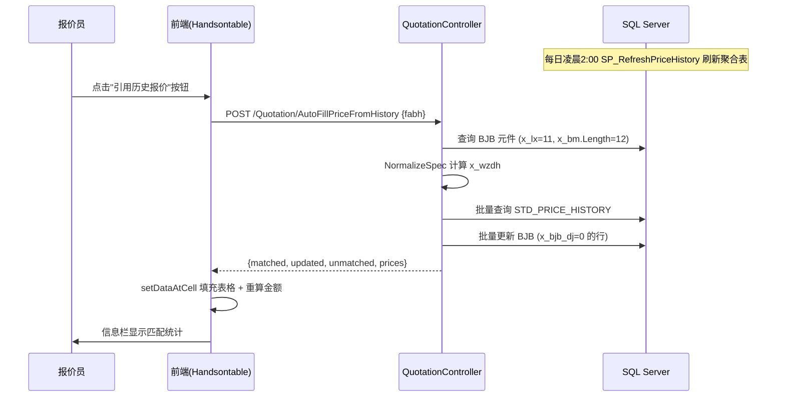
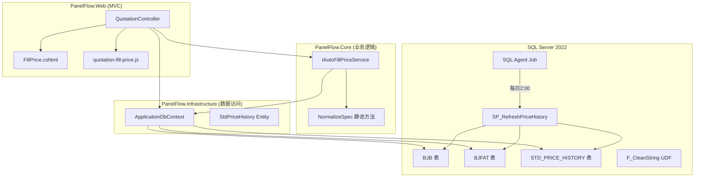

# Design Document: Auto-Fill Price

## Overview

自动填价功能为 PanelFlow 报价系统（业务流程第1步）提供历史价格自动匹配与填充能力。系统通过标准化指纹（x_wzdh）将当前报价单元件与历史报价数据关联，实现一键填充历史价格，减少报价员手动查价工作量。

**核心流程：**



**设计决策：**
- 采用"后端更新 + 前端同步"双写策略：后端在事务中批量更新 BJB 确保持久化，同时返回价格映射供前端即时刷新表格
- 使用 STD_PRICE_HISTORY 聚合表而非实时 JOIN，避免大表关联性能问题
- NormalizeSpec 纯函数设计，C# 与 SQL 实现保持一致，确保跨系统匹配准确性

## Architecture

### 系统分层架构



### 职责划分

| 层 | 组件 | 职责 |
|---|---|---|
| Web | QuotationController | 接收请求、权限校验、协调调用、返回结果 |
| Web | FillPrice.cshtml | 页面结构、Handsontable 初始化 |
| Web | quotation-fill-price.js | 表格交互、自动填充前端逻辑、异常检测着色 |
| Core | NormalizeSpec (static) | 规格型号标准化纯函数（已存在于 Controller，可保持） |
| Infrastructure | ApplicationDbContext | EF Core DbSet 映射 |
| Database | STD_PRICE_HISTORY | 历史价格聚合表 |
| Database | SP_RefreshPriceHistory | 每日刷新存储过程 |

## Components and Interfaces

### 后端 API 端点

#### POST /Quotation/AutoFillPriceFromHistory

**功能：** 查询历史价格并批量更新当前报价单中单价为0的元件行

**请求体：**
```json
{ "fabh": "BJ2026-001" }
```

**处理流程：**
1. 权限校验：验证登录状态、报价人/管理员身份、报价单状态（dqzt≠10）
2. 查询 BJB 中 x_lx=11、x_bm.Length=12 的元件行
3. 对 x_wzdh 为空的行实时调用 NormalizeSpec 计算指纹
4. 批量查询 STD_PRICE_HISTORY 获取匹配价格
5. 在事务中批量更新 x_bjb_dj=0 的行（写入 x_bjb_dj、x_bjb_bj、x_bj_dj）
6. 返回价格映射和统计信息

**成功响应：**
```json
{
  "success": true,
  "matched": 45,
  "updated": 30,
  "unmatched": 15,
  "total": 60,
  "message": "已匹配 45/60 个元件的历史报价，实际更新 30 个（15 个已有价格跳过），15 个元件无历史记录",
  "prices": {
    "abc123xyz": { "price": 12.50, "unit": "个", "vendor": "施耐德" },
    "def456uvw": { "price": 8.00, "unit": "只", "vendor": "正泰" }
  }
}
```

**错误响应：**
```json
{ "success": false, "message": "已成立的报价单不允许修改价格" }
```

#### GET /Quotation/GetCabinetComponents (已有，增强)

**增强内容：** 返回数据中已包含 `x_wzdh` 字段（若 DB 为空则实时计算）。无需新增端点。

#### GET /Quotation/GetReferencePrice

**功能：** 获取指定元件集合的参考价格（用于参考价格列和 tooltip）

**请求参数：** `id` (fabh), `unitCode` (控制柜编码)

**响应：**
```json
{
  "success": true,
  "rows": [
    { "lastPrice": 12.50, "avgPrice": 11.80, "minPrice": 9.00, "maxPrice": 15.00, "avgCount": 8 },
    null,
    { "lastPrice": 8.00, "avgPrice": 7.50, "minPrice": 6.00, "maxPrice": 10.00, "avgCount": 5 }
  ]
}
```

**说明：** 返回数组与 GetCabinetComponents 行序一一对应，无匹配记录的位置返回 null。

### 前端组件

#### quotation-fill-price.js 增强

| 功能模块 | 说明 |
|---|---|
| autoFillPrice() | 调用后端接口，处理响应，填充表格 |
| applyPriceToTable(prices) | 遍历表格行，按 x_wzdh 匹配并填充空价格单元格 |
| recalcAmount(row) | 重算金额列：x_bj_dj * (1 + x_fdds/100) * x_sl |
| loadReferencePrice(unitCode) | 加载参考价格列数据 |
| applyPriceAnomalyStyles() | 价格异常检测着色（灰/红/橙） |
| showPriceTooltip(row, col) | 显示参考价格/异常原因 tooltip |
| validateBeforeSave() | 保存前校验负数价格 |

### NormalizeSpec 算法（已实现）

```csharp
internal static string NormalizeSpec(string? input)
{
    // 1. 空值检查 → 返回 ""
    // 2. 转小写
    // 3. 去除不可见字符 (CR, LF, TAB, U+00A0, U+200B)
    // 4. 遍历字符：
    //    a. 全角转半角 (U+FF01~U+FF5E → -65248, U+3000 → ' ')
    //    b. 括号处理：'(' depth++跳过, ')' depth--跳过, depth>0 跳过
    //    c. 保留字符过滤：仅保留 a-z, 0-9, U+4E00~U+9FFF, μωΩ°±℃φ
    // 5. 返回结果（可能为空字符串）
}
```

**保留字符集：** `[a-z0-9\u4E00-\u9FFF μωΩ°±℃φ]`

**SQL 等价实现：** `dbo.F_CleanString(@input NVARCHAR(400))` — 逻辑完全一致

## Data Models

### 数据库表结构

#### STD_PRICE_HISTORY（新建表，已有 SQL 脚本）

| 字段 | 类型 | 约束 | 说明 |
|---|---|---|---|
| id | INT IDENTITY(1,1) | PK | 自增主键 |
| x_wzdh | NVARCHAR(400) | NOT NULL, UNIQUE IX | 标准化指纹 |
| ggxh | NVARCHAR(400) | NULL | 原始规格型号 |
| x_mc | NVARCHAR(100) | NULL | 元件名称 |
| x_dw | VARCHAR(10) | NULL | 计量单位 |
| x_sccj | NVARCHAR(100) | NULL | 厂商 |
| last_price | DECIMAL(18,4) | NOT NULL | 最新报价 |
| last_fabh | VARCHAR(50) | NULL | 来源方案编号 |
| last_date | DATETIME | NULL | 最新报价时间 |
| avg_price | DECIMAL(18,4) | NULL | 近5年均价 |
| avg_count | INT DEFAULT 0 | | 样本数 |
| min_price | DECIMAL(18,4) | NULL | 近5年最低价 |
| max_price | DECIMAL(18,4) | NULL | 近5年最高价 |
| updated_at | DATETIME DEFAULT GETDATE() | | 最后刷新时间 |

#### BJB 表（已有，相关字段）

| 字段 | 类型 | 说明 |
|---|---|---|
| fabh | CHAR(20) | 方案编号（关联 BJFAT） |
| x_bm | CHAR(100) | 元件编码（4位=控制柜，12位=元件行） |
| x_lx | INT | 类型（11=器件元件行） |
| x_mc | CHAR(100) | 元件名称 |
| x_ggxh | CHAR(100) | 规格型号 |
| x_dw | CHAR(10) | 计量单位 |
| x_bj_dj | NUMERIC(18,4) | 报价单价（用户填写/自动填充） |
| x_bjb_dj | NUMERIC(18,4) | 报价基准单价 |
| x_bjb_bj | NUMERIC(18,4) | 报价比价 |
| x_dj | NUMERIC(18,4) | 最终单价 = x_bj_dj * (1 + x_fdds/100) |
| x_sl | NUMERIC(18,4) | 数量 |
| x_fdds | NUMERIC(18,4) | 浮动点数（百分比） |
| x_sccj | CHAR(20) | 厂商 |
| x_wzdh | (NVARCHAR) | 标准化指纹 |
| x_bjb_datetime | DATETIME | 报价时间 |

#### BJFAT 表（已有，相关字段）

| 字段 | 类型 | 说明 |
|---|---|---|
| fabh | CHAR(20) | 方案编号 PK |
| bjr | CHAR(10) | 报价人 |
| dqzt | INT | 当前状态（10=已成立） |

### EF Core 实体映射

#### StdPriceHistory 实体（新增）

```csharp
public class StdPriceHistory
{
    public int Id { get; set; }
    public string x_wzdh { get; set; } = string.Empty;
    public string? ggxh { get; set; }
    public string? x_mc { get; set; }
    public string? x_dw { get; set; }
    public string? x_sccj { get; set; }
    public decimal last_price { get; set; }
    public string? last_fabh { get; set; }
    public DateTime? last_date { get; set; }
    public decimal? avg_price { get; set; }
    public int avg_count { get; set; }
    public decimal? min_price { get; set; }
    public decimal? max_price { get; set; }
    public DateTime? updated_at { get; set; }
}
```

**OnModelCreating 配置：**

```csharp
modelBuilder.Entity<StdPriceHistory>(entity =>
{
    entity.ToTable("STD_PRICE_HISTORY");
    entity.HasKey(e => e.Id);
    entity.HasIndex(e => e.x_wzdh).IsUnique();
    entity.Property(e => e.x_wzdh).HasColumnType("nvarchar(400)").IsRequired();
    entity.Property(e => e.last_price).HasColumnType("decimal(18,4)");
    entity.Property(e => e.avg_price).HasColumnType("decimal(18,4)");
    entity.Property(e => e.min_price).HasColumnType("decimal(18,4)");
    entity.Property(e => e.max_price).HasColumnType("decimal(18,4)");
});
```

### ViewModel / DTO

#### AutoFillPriceRequest

```csharp
public class AutoFillPriceRequest
{
    [Required]
    public string Fabh { get; set; } = string.Empty;
}
```

#### AutoFillPriceResult

```csharp
public class AutoFillPriceResult
{
    public bool Success { get; set; }
    public int Matched { get; set; }
    public int Updated { get; set; }
    public int Unmatched { get; set; }
    public int Total { get; set; }
    public string Message { get; set; } = string.Empty;
    public Dictionary<string, PriceInfo> Prices { get; set; } = new();
}

public class PriceInfo
{
    public decimal Price { get; set; }
    public string Unit { get; set; } = string.Empty;
    public string Vendor { get; set; } = string.Empty;
}
```

#### ReferencePriceRow（用于参考价格列）

```csharp
public class ReferencePriceRow
{
    public decimal? LastPrice { get; set; }
    public decimal? AvgPrice { get; set; }
    public decimal? MinPrice { get; set; }
    public decimal? MaxPrice { get; set; }
    public int? AvgCount { get; set; }
}
```

## Correctness Properties

*A property is a characteristic or behavior that should hold true across all valid executions of a system—essentially, a formal statement about what the system should do. Properties serve as the bridge between human-readable specifications and machine-verifiable correctness guarantees.*

### Property 1: NormalizeSpec output contains only allowed characters

*For any* input string, the output of NormalizeSpec SHALL contain only characters from the allowed set: ASCII lowercase letters (a-z), ASCII digits (0-9), CJK unified ideographs (U+4E00–U+9FFF), and unit symbols (μ, ω, Ω, °, ±, ℃, φ).

**Validates: Requirements 8.2, 8.4, 8.5**

### Property 2: NormalizeSpec removes all bracket content

*For any* input string containing matched parentheses, the output of NormalizeSpec SHALL NOT contain any characters that were enclosed within those parentheses. For unmatched left parentheses, the parenthesis character itself is discarded. For unmatched right parentheses at depth 0, the parenthesis character is discarded.

**Validates: Requirements 8.3**

### Property 3: NormalizeSpec C# and SQL equivalence

*For any* input string of length ≤ 400 characters, the C# NormalizeSpec function and the SQL F_CleanString function SHALL produce identical output.

**Validates: Requirements 8.6**

### Property 4: Auto-fill preserves non-zero prices

*For any* quotation and any element row where x_bj_dj > 0, executing the auto-fill operation SHALL NOT modify that row's x_bj_dj, x_bjb_dj, or x_bjb_bj values, regardless of whether a matching history price exists.

**Validates: Requirements 3.5, 5.2**

### Property 5: Auto-fill fills empty-price elements with matching history

*For any* element row where x_bj_dj = 0 (or null) and x_wzdh matches a record in STD_PRICE_HISTORY, executing the auto-fill operation SHALL set x_bj_dj = last_price from the matching history record. Additionally, if the element's unit is empty and history has a unit, it SHALL be filled; if the element's vendor is empty and history has a vendor, it SHALL be filled.

**Validates: Requirements 3.2, 3.3, 3.4, 5.1**

### Property 6: Auto-fill is idempotent

*For any* quotation, executing the auto-fill operation twice in succession SHALL produce the same database state as executing it once. The second execution SHALL report 0 updated rows (since all previously-zero prices are now non-zero).

**Validates: Requirements 4.7**

### Property 7: Amount formula correctness

*For any* element row with values x_bj_dj, x_fdds, and x_sl (treating null as 0), the computed amount SHALL equal `x_bj_dj * (1 + x_fdds / 100) * x_sl`, and the stored x_dj SHALL equal `x_bj_dj * (1 + x_fdds / 100)`.

**Validates: Requirements 3.9, 10.4, 10.5, 11.2, 11.4**

### Property 8: Negative price validation rejects save

*For any* set of element rows submitted for save, if any row has x_bj_dj < 0, the save operation SHALL be rejected and the response SHALL list all elements with negative prices by name and code.

**Validates: Requirements 10.1, 10.2**

### Property 9: Fill statistics accuracy

*For any* auto-fill operation result with matched count M, updated count U, unmatched count X, and total count N: M + X SHALL equal N, U SHALL be ≤ M, and (M - U) SHALL equal the number of elements that had matching history but already had non-zero prices.

**Validates: Requirements 3.6, 5.4**

### Property 10: Price deviation detection

*For any* element row with x_bj_dj > 0 and a corresponding avg_price > 0 from STD_PRICE_HISTORY, the deviation flag SHALL be set if and only if `|x_bj_dj - avg_price| / avg_price > 0.2`. If avg_price is 0 or no history exists, no deviation check SHALL be performed.

**Validates: Requirements 9.3, 9.4**

### Property 11: Summary grouping correctness

*For any* set of element rows grouped by (x_mc, x_ggxh, x_dj), the reported aggregate quantity for each group SHALL equal the sum of x_sl across all rows in that group, and the total amount SHALL equal the sum of all group subtotals (x_dj * group_qty).

**Validates: Requirements 15.2, 15.4**

### Property 12: Authorization enforcement

*For any* user who is neither the quotation's bjr (owner) nor an admin, and for any quotation with dqzt = 10 (finalized), the auto-fill operation SHALL be rejected with an appropriate error status.

**Validates: Requirements 7.3, 7.5**

## Error Handling

### 后端错误处理策略

| 场景 | 处理方式 | HTTP 状态码 |
|---|---|---|
| 未登录 | 返回 401，前端重定向登录页 | 401 |
| 非报价人且非管理员 | 返回 403 + 错误信息 | 403 |
| 报价单不存在 | 返回 404 + 错误信息 | 404 |
| 报价单已成立 (dqzt=10) | 返回 400 + "已成立的报价单不允许修改价格" | 400 |
| 无有效元件行 | 返回成功但 matched=0 | 200 |
| 数据库查询异常 | 记录日志，返回 500 + 通用错误信息 | 500 |
| 批量更新事务失败 | 回滚事务，记录日志，返回 500 | 500 |
| 保存时存在负数价格 | 拒绝保存，返回 400 + 负价格元件列表 | 400 |
| CSRF Token 无效 | ASP.NET 框架自动返回 400 | 400 |

### 前端错误处理策略

| 场景 | 处理方式 |
|---|---|
| 未加载数据时点击按钮 | 信息栏提示"请先点击左侧控制柜节点加载元件数据" |
| 请求超时 (30s) | 中止请求，信息栏显示超时错误，恢复按钮 |
| 网络错误 | 信息栏显示"网络错误，请检查连接后重试" |
| 401 响应 | 提示登录过期，引导重新登录 |
| 403 响应 | 信息栏显示权限不足信息 |
| 500 响应 | 信息栏显示服务器错误信息 |
| 保存前检测到负价格 | 阻止提交，信息栏列出负价格元件 |

### 日志记录

- 自动填价查询失败：`LogError` 记录异常详情和 fabh
- 批量更新失败：`LogError` 记录异常详情、fabh、影响行数
- 权限拒绝：`LogWarning` 记录用户名、fabh、拒绝原因

## Testing Strategy

### 测试框架选择

- **单元测试框架：** xUnit
- **属性测试框架：** FsCheck.Xunit（C# 友好的 PBT 库）
- **Mock 框架：** Moq（用于 DbContext 和外部依赖模拟）
- **前端测试：** Jest + jsdom（用于纯逻辑函数测试）

### 属性测试（Property-Based Testing）

每个属性测试配置最少 **100 次迭代**，使用 FsCheck 生成随机输入。

**测试标签格式：** `Feature: auto-fill-price, Property {N}: {description}`

| Property | 测试目标 | 生成器策略 |
|---|---|---|
| P1 | NormalizeSpec 输出字符集 | 生成包含全角、括号、特殊符号、CJK 的随机字符串 |
| P2 | NormalizeSpec 括号移除 | 生成含嵌套/孤立括号的字符串 |
| P3 | C#/SQL 等价性 | 生成 ≤400 字符的随机字符串，同时调用两个实现 |
| P4 | 非零价格保留 | 生成含不同价格状态的元件集合 |
| P5 | 空价格填充 | 生成元件集合 + 历史价格映射 |
| P6 | 幂等性 | 生成元件集合，执行两次填充 |
| P7 | 金额公式 | 生成随机 decimal 三元组 (price, fdds, qty) |
| P8 | 负价格拒绝 | 生成含负数价格的元件集合 |
| P9 | 统计准确性 | 生成不同匹配状态的元件集合 |
| P10 | 偏离检测 | 生成 (price, avg_price) 对 |
| P11 | 汇总分组 | 生成含重复名称/规格的元件集合 |
| P12 | 权限拒绝 | 生成不同角色/状态组合 |

### 单元测试（Example-Based）

| 测试类别 | 覆盖内容 |
|---|---|
| NormalizeSpec 边界 | NULL、空字符串、纯空白、纯符号输入 |
| 权限场景 | 未登录、非报价人、管理员、报价人本人 |
| UI 状态 | 按钮禁用/启用、加载状态、错误显示 |
| 参考价格列 | 无匹配时显示空、tooltip 内容 |
| 保存流程 | 事务回滚、成功响应 |

### 集成测试

| 测试场景 | 验证内容 |
|---|---|
| SP_RefreshPriceHistory 执行 | 验证 MERGE 正确插入/更新，筛选条件正确 |
| AutoFillPriceFromHistory 端到端 | 验证完整流程：查询→匹配→更新→响应 |
| SavePlan 写入 x_wzdh | 验证保存时 NormalizeSpec 被正确调用 |
| 参考价格查询 | 验证 GetReferencePrice 返回正确数据 |

### 测试数据策略

- 属性测试使用 FsCheck 生成器，覆盖边界值和随机组合
- 集成测试使用 SQL Server LocalDB 或内存数据库
- NormalizeSpec C#/SQL 等价性测试需要真实 SQL Server 连接（调用 F_CleanString）

### 前端测试

| 模块 | 测试方式 |
|---|---|
| recalcAmount() | Jest 单元测试 + 属性测试（随机 decimal 输入） |
| applyPriceToTable() | Jest 单元测试（mock Handsontable API） |
| applyPriceAnomalyStyles() | Jest 单元测试（验证着色逻辑） |
| validateBeforeSave() | Jest 单元测试（负价格检测） |
| 偏离检测公式 | Jest 属性测试（fast-check 库） |
