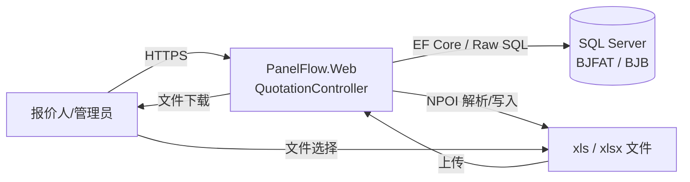
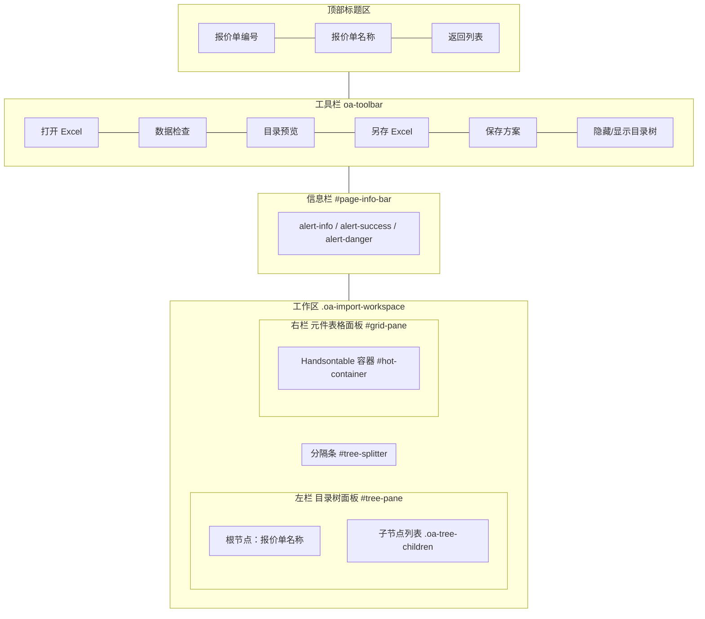
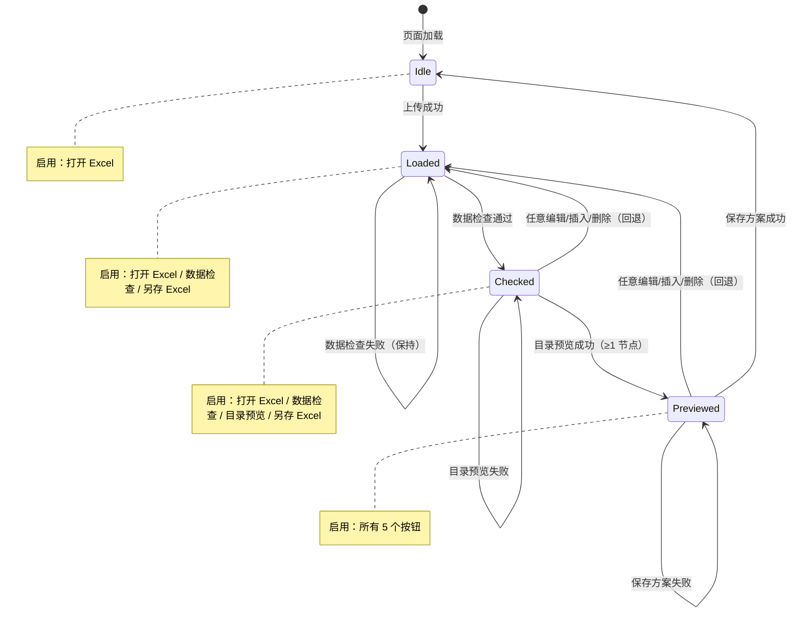
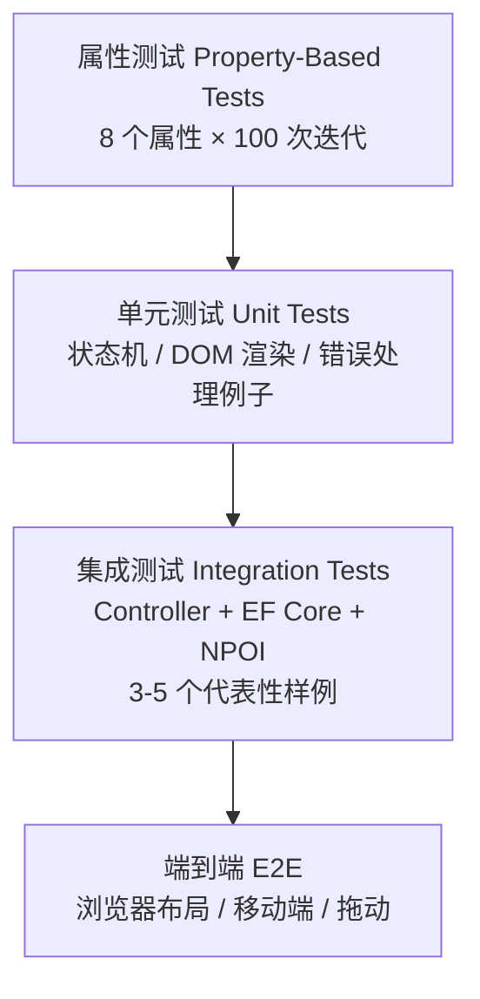

# 设计文档：报价单导入元件页面重设计（Import Components Redesign）

## Overview

本设计针对 `Quotation/ImportComponents` 页面进行**全面重设计**，目标是在**完全保留现有业务功能**的前提下，
按照项目 steering 规范（`project-core` / `coding-standards` / `db-compatibility` / `frontend-delivery` / `business-workflow`）
对页面布局、交互流程、按钮可用性闭环、错误反馈、移动端体验进行结构化重构。

业务背景：

- 本页面是**第 1 阶段「报价」** 的关键入口（见 `business-workflow.md` 第 1 阶段：导入客户 BOM 表 → 填写单价 → 生成报价单 → 发送客户）。
- 数据库与原 PowerBuilder 系统共用，必须严格保护 `BJFAT` / `BJB` 表结构与 4 位 / 12 位编码规则。
- 技术栈：ASP.NET MVC + Bootstrap 5 + Handsontable + NPOI；无 Service Worker。

设计原则：

| 原则 | 描述 |
|------|------|
| 业务功能 0 损失 | 现有 5 类操作（上传 / 检查 / 预览 / 保存方案 / 另存 Excel）+ 节点定位 + 拆分逻辑必须 100% 保留 |
| 数据兼容优先 | `BJB` 写入流程（DELETE → 4 位主节点 → 5 条固定子类型 → 12 位元件）严格保留，编码规则、字段语义不变 |
| 可观测可恢复 | 所有失败路径必须给出明确文字反馈，可重试；Backend 异常必须 `_logger.LogError` |
| 状态闭环 | 4 个核心按钮（数据检查 / 目录预览 / 另存 Excel / 保存方案）必须形成"上一步通过 → 下一步可用"的状态机 |
| 移动端可用 | 320px 起不出现横向滚动条，安全区适配，左侧目录树在小屏默认折叠 |

不在本设计范围内：

- BJB 表结构变更（禁止）
- 报价人/管理员之外的权限模型扩展
- 引入新的前端框架（Vue/React）或新的表格库
- 多 sheet 解析 / xlsx 公式重新求值 / 排版样式
- Service Worker 或离线缓存

---

## Architecture

### 系统上下文



### 应用分层

按 `project-core.md` 的分层规则：

| 层 | 职责 | 本次设计落点 |
|---|------|-------------|
| **PanelFlow.Web (MVC)** | 路由、Razor 视图、参数绑定、Session 校验、AntiForgeryToken | `QuotationController` 现有 5 个 Action（保留）+ ImportComponents.cshtml（重设计） |
| **PanelFlow.Core (业务/接口)** | 仅 `RoleNames` / `IPermissionService` 用于鉴权常量 | 不新增 Service 抽象（按 `coding-standards.md`：Controller 可直连 `ApplicationDbContext`，本页面作业范围有限，不下沉） |
| **PanelFlow.Infrastructure (数据)** | `ApplicationDbContext` / `BjbItem` / `BjfatQuotation` 实体 | 复用现有实体，零侵入 |
| **wwwroot/js/quotation-import.js** | 浏览器端表格、目录树、状态机、上传/下载客户端 | **整体重写**，拆分为模块化函数；保留所有外部接口（按钮 ID / data-* 属性）契约 |
| **wwwroot/css/quotation-import.css** | 页面专属样式（新增） | 双栏布局、分隔条、移动端折叠面板、信息栏样式 |

> 决策：**不引入 Service 层**。原因：本页面所有 Backend 写操作仅落在单一 Controller 内，代码量与事务边界都在可控范围；`coding-standards.md` 明确"Controller 可以直接注入并使用 `ApplicationDbContext`"，且"以下情况建议提取到 Service 层（但不强制）"。
> 后续若 `BuildRowsFromTable` 需要被其他 Controller 复用，再考虑下沉到 `PanelFlow.Core/Services`。

### 页面交互流程

```mermaid
flowchart TD
    Start([用户访问 /Quotation/ImportComponents/{id}]) --> Init[初始化加载<br/>查询 BJFAT + BJB 4位节点]
    Init -->|找到方案| Render[渲染目录树 + 空表格]
    Init -->|未找到| Redir[跳转 /Quotation/Index<br/>TempData 错误]
    Render --> Idle[空闲态：仅启用「打开 Excel」]
    Idle -->|点击打开 Excel| Upload[POST UploadImportExcel]
    Upload -->|失败| Idle
    Upload -->|成功| Loaded[已加载态：启用「数据检查」+「另存 Excel」]
    Loaded -->|点击数据检查| Check{validateRows}
    Check -->|失败| Loaded
    Check -->|成功| Checked[已检查态：启用「目录预览」]
    Checked -->|编辑 / 插入 / 删除行| Loaded
    Checked -->|点击目录预览| Preview[buildPreviewNodes]
    Preview -->|节点为空| Checked
    Preview -->|生成 N 节点| Previewed[已预览态：启用「保存方案」]
    Previewed -->|currentStatus≠1| ConfirmA[第一次确认]
    ConfirmA -->|确认| ConfirmB[第二次确认]
    Previewed -->|currentStatus=1| Save
    ConfirmB -->|确认| Save[POST SavePlan]
    Save -->|权限/校验失败| Previewed
    Save -->|事务成功| Done[显示 N 条已写入]
    Done --> Render
```

### 关键设计决策

| 决策 | 选项 | 选择 | 理由 |
|------|------|------|------|
| 状态机实现位置 | A. 后端 ViewState  B. 前端单页内存 | **B** | 业务流程是单页操作链，刷新即重来；放后端会引入 Session 状态污染 |
| 保留 `window.confirm` 还是改 Bootstrap Modal | A. confirm  B. Modal | **B** | `frontend-delivery.md` 要求"用户体验一致"；`window.confirm` 在 iOS Safari 上样式不可控；同时保留键盘可达性 |
| 是否抽取 BuildRowsFromTable 到 Service | A. Controller 内部静态方法（现状）B. 下沉 Core | **A（保留）** | 单 Controller 使用、无跨复用；改动会扩大本次重设计的影响面 |
| Excel 解析库 | NPOI（现状） | **保留 NPOI** | `coding-standards.md` 指定 NPOI |
| 错误反馈位置 | A. Bootstrap Toast  B. 顶部 InfoBar（现状） | **B** | 需求 8.3 要求"InfoBar 始终可见，不自动消失"；Toast 4 秒消失会丢失错误现场 |
| 移动端目录树默认状态 | A. 展开  B. 折叠 | **B**（< 768px） | 需求 9.4；空间太小，强制展开会挤压 ComponentGrid |
| 节点定位失败提示 | A. 抛出异常  B. InfoBar 红色文字 | **B** | 节点定位是辅助操作，失败不应中断流程 |

### 布局重设计（双栏 + 折叠 + 顶部工具栏）



设计要点：

1. **顶部工具栏统一收纳所有操作按钮**（打破现状中"保存方案"散落在左栏底部、"打开 Excel"在右栏底部的割裂感）。
2. **左栏目录树面板**仅承载导航职责，不再承载"保存方案"按钮。
3. **InfoBar 全宽常驻**，提供 `alert-info` / `alert-success` / `alert-danger` 三种状态。
4. **可拖动分隔条** `#tree-splitter`（最小 220px、最大工作区 60%）；折叠时分隔条隐藏。
5. **小屏（< 768px）**：左栏默认折叠为可顶部下拉的"控制柜列表"按钮；工具栏改为可横向滚动的 sticky 容器。

---

## Components and Interfaces

### Backend：QuotationController（保留 + 微调）

按"只改动必要的文件"原则，**全部保留**现有 5 个 Action（路由、签名、返回结构）：

| Action | 路由 | 现状 | 本次调整 |
|--------|------|------|---------|
| `ImportComponents(string id)` | `GET /Quotation/ImportComponents/{id}` | 渲染视图 | **保留**；返回 `QuotationPriceViewModel`（已存在） |
| `UploadImportExcel(string id, IFormFile file)` | `POST /Quotation/UploadImportExcel/{id}` | NPOI 解析、5000 行截断、连续 5 空行截断 | **保留**；新增 10MB 大小校验（需求 2.4） |
| `SaveImportExcel(QuotationExcelSaveRequest)` | `POST /Quotation/SaveImportExcel` | 生成 xlsx 下载 | **保留**；文件名格式不变 |
| `SavePlan(QuotationPlanSaveRequest)` | `POST /Quotation/SavePlan` | 权限校验、事务、DELETE + INSERT | **保留**；显式校验 `treeNodeNames.Count == Σ SplitCount`（HTTP 400） |
| 视图 `ImportComponents.cshtml` | `Views/Quotation/ImportComponents.cshtml` | 内联样式 + 单文件 JS | **重设计**：Razor 模板重写；CSS 抽到独立文件；JS 重写 |

#### 微调 1：UploadImportExcel 增加 10 MB 大小校验

```csharp
// 现状：仅在 file == null || file.Length <= 0 时拒绝
// 调整：
const long maxBytes = 10L * 1024 * 1024;
if (file.Length > maxBytes)
    return Json(new { success = false, message = "文件大小不能超过 10 MB" });
```

#### 微调 2：SavePlan 显式校验目录树节点数

`BuildRowsFromTable` 已经会在不一致时抛 `InvalidOperationException`（被 `catch (InvalidOperationException) → BadRequest` 捕获）。本次新增**显式前置校验**，使错误消息更精确（需求 5.6）：

```csharp
var sourceUnits = ParseSourceUnits(tableJson);  // 提取为本地复用
var expectedNodeCount = sourceUnits.Sum(u => u.SplitCount);
if (expectedNodeCount != treeNodeNames.Count)
{
    return BadRequest(new {
        success = false,
        message = "目录树节点数量与表格单元拆分数量不一致，请重新执行目录预览"
    });
}
```

### Frontend：ImportComponents.cshtml（视图重设计）

强类型 model：复用 `QuotationPriceViewModel`（无需新增 ViewModel）。

页面结构（伪代码）：

```cshtml
@model QuotationPriceViewModel
<link rel="stylesheet" href="~/lib/handsontable/handsontable.full.min.css" />
<link rel="stylesheet" href="~/css/quotation-import.css" asp-append-version="true" />

<header class="oa-import-header">
    <h5>报价单：@Model.QuotationNo</h5>
    <span>@Model.QuotationName</span>
    <a href="/Quotation/Index">返回列表</a>
</header>

<div class="oa-import-toolbar" role="toolbar">
    <button id="open-excel-btn">打开 Excel 元件表</button>
    <button id="check-data-btn" disabled>数据检查</button>
    <button id="preview-tree-btn" disabled>目录预览</button>
    <button id="save-excel-btn" disabled>另存 Excel</button>
    <button id="save-plan-btn" disabled>保存方案</button>
    <button id="toggle-tree-btn">隐藏目录树</button>
</div>

<div id="page-info-bar" class="alert alert-info">提示：……</div>

<div class="oa-import-workspace">
    <aside id="tree-pane">
        <ul class="oa-tree-root">
            <li id="tree-root-node">@Model.QuotationName</li>
            <ul id="tree-children-container">
                @if (Model.TreeNodes.Count == 0) {
                    <li class="oa-tree-empty">暂无控制柜节点</li>
                } else {
                    @foreach (var n in Model.TreeNodes) { ... }
                }
            </ul>
        </ul>
    </aside>
    <div id="tree-splitter" role="separator"></div>
    <main id="grid-pane">
        <div id="hot-container"
             data-license-key="53ea8-c2678-49b80-cb40f-4dad4"
             data-upload-url="@uploadUrl"
             data-save-url="@saveExcelUrl"
             data-save-plan-url="@savePlanUrl"
             data-quotation-no="@Model.QuotationNo"
             data-current-status="@Model.CurrentStatus"></div>
        <form id="excel-upload-form" class="d-none" method="post" enctype="multipart/form-data">
            @Html.AntiForgeryToken()
            <input id="excel-file-input" type="file" accept=".xls,.xlsx" />
        </form>
    </main>
</div>

<!-- Bootstrap Modal：保存方案确认 -->
<div class="modal fade" id="save-plan-confirm-modal" ...>...</div>

@section Scripts {
    <script src="~/lib/handsontable/handsontable.full.min.js"></script>
    <script src="~/js/quotation-import.js" asp-append-version="true"></script>
}
```

设计要点：

- **强类型 `@model`**（符合 `frontend-delivery.md`）。
- **AntiForgeryToken** 由 `<form id="excel-upload-form">` 提供，所有 fetch 请求从该表单读取 token 写到 `RequestVerificationToken` 头。
- **不在 .cshtml 内联大量脚本**：所有逻辑放在 `wwwroot/js/quotation-import.js`。
- **Bootstrap Modal 替代 `window.confirm`**：消除 iOS Safari 样式不一致问题。

### Frontend：quotation-import.js（重写）

模块化结构（IIFE 内拆分多个内部函数）：

```javascript
(() => {
    // ---- 1) 初始化与依赖装配 ----
    const ctx = readDatasetContext();        // upload/save/savePlanUrl/quotationNo/currentStatus
    const dom = readDomReferences();         // 所有按钮、容器、表单、模态框
    if (!ctx.isReady || !dom.isReady) return;

    // ---- 2) 状态管理 ----
    const state = {
        hasLoadedExcelData: false,
        hasCheckPassed: false,
        hasPreviewSucceeded: false,
        invalidCells: new Set(),
        invalidRows: new Set(),
    };
    function applyButtonStates() { ... }     // 单一入口：根据 state 同步 5 个按钮的 disabled

    // ---- 3) Handsontable 初始化 ----
    const hot = createHotInstance(dom.container, ctx.licenseKey, errorCellRenderer);
    hot.addHook("afterChange", invalidateOnEdit);
    hot.addHook("afterCreateRow", invalidateOnEdit);
    hot.addHook("afterRemoveRow", invalidateOnEdit);

    // ---- 4) InfoBar ----
    function setInfo(message, level)         // level ∈ {info, success, error}

    // ---- 5) 验证（纯函数，便于属性测试） ----
    function validateRows(rows)              // 返回 { errors, invalidCells, invalidRows }

    // ---- 6) 目录预览（纯函数 + 渲染） ----
    function buildSplitNames(baseName, n)
    function buildPreviewNodes(rows)         // 返回 [{ unitNo, displayName }]
    function renderTreeChildren(nodes)

    // ---- 7) 节点定位 ----
    function focusUnitInGrid(unitName)

    // ---- 8) 上传 / 检查 / 预览 / 保存 / 导出 ----
    async function uploadExcel(file)
    function runDataCheck()
    function runDirectoryPreview()
    async function exportExcel()
    async function savePlan()                // 内部触发 Bootstrap Modal 双重确认

    // ---- 9) 布局：分隔条拖动 + 折叠 + 移动端 ----
    setupSplitter(dom.treePane, dom.splitter);
    setupTreeToggle(dom.toggleBtn, dom.treePane, dom.splitter);
    setupMobileDefaults();                   // 屏幕 < 768px 默认折叠

    // ---- 10) 事件绑定 ----
    dom.openBtn.addEventListener("click", () => dom.fileInput.click());
    dom.fileInput.addEventListener("change", ...);
    dom.checkBtn.addEventListener("click", runDataCheck);
    dom.previewBtn.addEventListener("click", runDirectoryPreview);
    dom.saveExcelBtn.addEventListener("click", exportExcel);
    dom.savePlanBtn.addEventListener("click", savePlan);
    dom.treeChildrenContainer.addEventListener("click", onTreeNodeClick);

    applyButtonStates();
})();
```

模块边界与契约：

| 函数 | 输入 | 输出 | 副作用 |
|------|------|------|--------|
| `validateRows(rows)` | `string[][]` | `{ errors: string[], invalidCells: Set<"r:c">, invalidRows: Set<number> }` | 无（纯函数） |
| `buildSplitNames(baseName, n)` | `string`, `number 1..99` | `string[]` 长度 = n | 无 |
| `buildPreviewNodes(rows)` | `string[][]` | `{ unitNo, displayName }[]` | 无 |
| `setInfo(msg, level)` | `string`, `"info"\|"success"\|"error"` | `void` | 修改 InfoBar DOM |
| `applyButtonStates()` | 读 state | `void` | 修改按钮 disabled |

> 把 `validateRows` / `buildSplitNames` / `buildPreviewNodes` 设计为**纯函数**，便于在 fast-check（或类似库）中做属性测试（见后文 Testing Strategy）。

### Frontend：quotation-import.css（新增）

类名前缀 `oa-`（符合 `frontend-delivery.md`），按 BEM 思路命名：

```css
/* 页面骨架 */
.oa-import-header { display:flex; gap:1rem; padding:.75rem 0; flex-wrap:wrap; }
.oa-import-toolbar { display:flex; gap:.5rem; flex-wrap:wrap; padding:.5rem; background:#fff; border-radius:8px; margin-bottom:.75rem; }

/* 工作区双栏 */
.oa-import-workspace { display:flex; gap:0; min-height:60vh; }
.oa-import-tree-pane { width:280px; min-width:220px; max-width:60%; background:#fff; border-radius:8px; padding:1rem; transition:width .15s ease; }
.oa-import-tree-pane.is-collapsed { display:none; }
.oa-import-splitter { width:8px; cursor:col-resize; user-select:none; }
.oa-import-splitter.is-hidden { display:none; }
.oa-import-grid-pane { flex:1; min-width:320px; background:#fff; border-radius:8px; padding:1rem; }

/* 目录树节点 */
.oa-tree-root, .oa-tree-children { list-style:none; padding-left:0; }
.oa-tree-children { margin-left:1.25rem; }
.oa-tree-link { background:none; border:0; padding:.25rem .5rem; text-align:left; width:100%; cursor:pointer; color:inherit; border-radius:4px; }
.oa-tree-link:hover { background:#e9ecef; color:#0d6efd; }
.oa-tree-empty { color:#6c757d; padding:.25rem .5rem; }

/* InfoBar 已使用 Bootstrap .alert，仅复写 margin */
#page-info-bar { margin-bottom:.75rem; }

/* 移动端 */
@media (max-width: 768px) {
    .oa-import-workspace { flex-direction:column; }
    .oa-import-tree-pane { width:100% !important; max-width:100%; }
    .oa-import-splitter { display:none; }
    .oa-import-toolbar { position:sticky; top:0; z-index:5; overflow-x:auto; -webkit-overflow-scrolling:touch; }
}

/* 安全区适配 */
@supports (padding-top: env(safe-area-inset-top)) {
    .oa-import-header { padding-top: max(.5rem, env(safe-area-inset-top)); }
    .oa-import-workspace { padding-bottom: env(safe-area-inset-bottom); }
}
```

> 严格控制 `!important` 仅用于移动端覆盖宽度（符合 `frontend-delivery.md`：避免滥用，但允许针对响应式必要场景）。

### 与 Bootstrap Modal 的对接（保存方案双重确认）

视图中加入隐藏的 `<div class="modal" id="save-plan-confirm-modal">`。
JS 中统一调用：

```javascript
async function savePlan() {
    if (Number(ctx.currentStatus) !== 1) {
        const ok1 = await confirmWithModal({
            title: "覆盖提示",
            body: "当前报价单有数据，导入时会清空原来数据，是否继续？",
            confirmText: "继续",
        });
        if (!ok1) return;
        const ok2 = await confirmWithModal({
            title: "再次确认",
            body: "确定要覆盖当前报价单吗？",
            confirmText: "确认覆盖",
            confirmClass: "btn-danger",
        });
        if (!ok2) return;
    }
    await postSavePlan();
}
```

`confirmWithModal` 为本文件内的小型 Promise 包装器（基于 `bootstrap.Modal`），不污染全局命名空间。

---

## Data Models

### 现有 BJB 编码规则（保留，不改动）

| 编码长度 | 含义 | x_lx |
|---------|------|------|
| 4 | 控制柜主节点（CabinetNode） | 1 |
| 8 | 子类型节点（前 4 位 = 控制柜编码，后 4 位 ∈ {0001..0005}） | 11..15 |
| 12 | 元件节点（4 位控制柜 + "0001" + 4 位元件序号） | 11 |

特殊编码：
- `"0"` 与 `"9999"`：保留节点，**任何写操作都不得删除**。
- `dqzt`（BJFAT.当前状态）：1 = 空报价单（直接保存）；非 1 = 需要双重确认。

### View Model（`QuotationPriceViewModel`，已存在，复用）

```csharp
public class QuotationPriceViewModel
{
    public string QuotationNo { get; set; }
    public string QuotationName { get; set; }
    public int CurrentStatus { get; set; }
    public string ActiveSection { get; set; } = PriceSection.ImportComponents;
    public List<QuotationTreeNodeViewModel> TreeNodes { get; set; } = [];
}

public class QuotationTreeNodeViewModel
{
    public string Code { get; set; }   // 4 位主节点编码（如 "0001"）
    public string Name { get; set; }   // 显示名（NULL/空时回退 Code）
}
```

### Request DTO（保留现有）

```csharp
// POST UploadImportExcel：multipart/form-data，IFormFile + id（路由）

public class QuotationExcelSaveRequest               // POST SaveImportExcel
{
    public string QuotationNo { get; set; }
    public List<List<string?>> Rows { get; set; }   // 8 列，不足补空
}

public class QuotationPlanSaveRequest                // POST SavePlan
{
    public string Fabh { get; set; }
    public List<List<string?>> TableJson { get; set; }
    public List<string?> TreeNodeNames { get; set; }
}
```

### Backend 内部模型（保留）

```csharp
internal class SourceUnitBlock {
    public int SplitCount { get; set; } = 1;
    public List<ComponentSourceRow> Components { get; set; } = [];
}
internal class ComponentSourceRow {
    public string Name, Spec, Vendor;
    public decimal Price, Qty;
}
internal class BjbWriteRow {
    public string Xbm, Xmc, Xggxh, Xsccj;
    public decimal Xdj, Xsl, XbjDj, XbjbBj, XbjbDj;
    public int Xlx;
}
```

### Frontend 内部模型

```typescript
// 仅 JSDoc 类型注释（项目无 TS 编译，但保留语义清晰度）

/** @typedef {{ unitNo: string, displayName: string }} PreviewNode */
/** @typedef {{ errors: string[], invalidCells: Set<string>, invalidRows: Set<number> }} ValidationResult */
/** @typedef {{ hasLoadedExcelData: boolean, hasCheckPassed: boolean, hasPreviewSucceeded: boolean, invalidCells: Set<string>, invalidRows: Set<number> }} PageState */
```

### 状态机（前端）




---

## Correctness Properties

> **属性（Property）** 是系统在所有合法执行路径上都应保持的特征或行为：它是关于"系统应该做什么"的形式化陈述。属性是"人类可读规范"与"机器可验证的正确性保证"之间的桥梁。

> **PBT 适用性评估**：本特性的核心计算逻辑（数据验证、拆分命名、写库行结构构建、Excel 往返）均为**纯函数**或可隔离为纯函数，输入空间巨大，存在明确的全称量化属性，**适合**采用属性测试。
> 不适合 PBT 的部分（数据库读取、UI 渲染、布局像素值、AntiForgeryToken 校验、文件下载触发等）通过单元测试 / 集成测试覆盖，不写入本节。

### Property 1: 数量列必须为有限正数

*For any* 非空行（至少一列含非空白字符），若第 6 列（Quantity）trim 后为空字符串、非数字字符串、或解析得到的数 ∉ (0, 999999999.99]，则 `validateRows(rows)` 返回结果中 `invalidCells` 必须包含 `${rowIndex}:5`，且 `errors` 列表至少包含一条与该行号相关的错误。

**Validates: Requirements 3.2, 3.3**

### Property 2: 单元号 / 名称 / 规格不得同时为空

*For any* 非空行，若第 2 列（UnitCode）、第 3 列（名称）、第 4 列（规格）trim 后均为空字符串，则 `validateRows(rows)` 返回结果中 `invalidCells` 至少包含 `${rowIndex}:1` / `${rowIndex}:2` / `${rowIndex}:3` 之一。

**Validates: Requirements 3.4**

### Property 3: UnitCode 重复必须被全部标记

*For any* 行集 `rows`，若存在 `i ≠ j` 使 `rows[i][1].trim() === rows[j][1].trim()` 且该值非空，则 `validateRows(rows).invalidCells` 必须同时包含 `${i}:1` 与 `${j}:1`，且 `errors` 至少包含一条引用任一相关行号的"重复"错误。UnitCode 为空的行不参与重复检测。

**Validates: Requirements 3.5**

### Property 4: 连续 5 空行后的非空行必须被标记

*For any* 行集 `rows`，若存在索引 `k` 使 `rows[k-5..k-1]` 全部为空行（每列 trim 后均为空白）且 `rows[k]` 至少有一列非空，则 `validateRows(rows).invalidRows` 必须包含 `k`，且 `errors` 至少包含一条引用第 `k+1` 行的连续空行错误。

**Validates: Requirements 3.6**

### Property 5: 拆分节点数量与命名守恒

*For any* `baseName ∈ string` 与 `N ∈ [1, 99] ∩ ℤ`，`buildSplitNames(baseName, N)` 必须满足：
1. 返回数组长度严格等于 `N`；
2. 所有元素互不相同（distinct）；
3. 首元素严格等于 `baseName.trim()`；
4. 当 `baseName` 末尾存在数字段时，元素 `i (i ∈ 1..N-1)` 的数字段值等于元素 0 的数字段值加 `i`，且该数字段最小宽度等于元素 0 中该数字段的字符宽度。

**Validates: Requirements 4.3, 4.4, 4.5, 4.6**

### Property 6: SavePlan 节点数一致性守恒

*For any* `(tableJson, treeNodeNames)` 输入对，若 `treeNodeNames.Count` 不等于 `ParseSourceUnits(tableJson).Sum(u => u.SplitCount)`，则 `BuildRowsFromTable(tableJson, treeNodeNames)` 必须抛出 `InvalidOperationException`，且不得返回任何 BJB 写入行（即调用方据此返回 HTTP 400，BJB 表零写入）。

**Validates: Requirements 5.6**

### Property 7: BJB 写入行结构正确性

*For any* 含 `M ≥ 0` 个 CabinetNode、第 `i` 个 CabinetNode 含 `K_i ≥ 0` 个元件的方案，且 `treeNodeNames.Count == M`（满足前置一致性），`BuildRowsFromTable` 返回的记录满足：
1. 总记录数严格等于 `Σ_{i=1..M}(1 + 5 + K_i)`；
2. 4 位主节点（`x_lx = 1`，`Xbm.Length = 4`）记录数 = `M`；
3. 8 位子类型节点（`Xbm.Length = 8` 且后 4 位 ∈ {0001..0005}）记录数 = `5 * M`；
4. 12 位元件节点（`Xbm.Length = 12` 且 `Xbm.Substring(4, 4) == "0001"`）记录数 = `Σ K_i`。

**Validates: Requirements 5.7**

### Property 8: Excel 导出/导入往返一致性

*For any* 合法的 ComponentGrid 数据集 `rows`（`1 ≤ |rows| ≤ 5000`，每行 8 列任意可表达字符串内容，不含连续 5 个空行），将 `rows` 通过 `SaveImportExcel` 导出为 xlsx 文件流，再通过 `UploadImportExcel` 重新导入，得到的 `roundTripped` 必须满足：
- `roundTripped.Length == rows.Length`；
- 对所有 `i ∈ [0, rows.Length)`、`c ∈ [0, 8)`，`roundTripped[i][c].Trim() == rows[i][c].Trim()`（忽略首尾空白与单元格数字格式化差异）。

**Validates: Requirements 6.2, 6.3**

---

## Error Handling

### 后端异常分类与响应

| 错误类型 | HTTP 状态 | 响应体 | 日志 | InfoBar 文案 |
|---------|----------|--------|------|------------|
| 路由 `id` 无效 / BJFAT 无记录 | 302 | TempData 错误 | 否 | "报价单不存在"（重定向到列表） |
| Excel 扩展名错误 | 200 + `success:false` | `{ success:false, message }` | 否 | "仅支持 .xls / .xlsx 文件" |
| Excel 大小超过 10MB | 200 + `success:false` | `{ success:false, message }` | 否 | "文件大小不能超过 10 MB" |
| Excel 内容空 / 工作表无效 | 200 + `success:false` | `{ success:false, message }` | 否 | "Excel 中没有可读取的工作表" |
| Excel 解析异常 | 200 + `success:false` | `{ success:false, message }` | `LogError` | "Excel 读取失败：{ex.Message}" |
| SavePlan：未登录 | 401 | `{ success:false, message }` | 否 | "登录已失效，请重新登录后再试" |
| SavePlan：方案不存在 | 404 | `{ success:false, message }` | 否 | "方案不存在" |
| SavePlan：非本人/非管理员 | 403 | `{ success:false, message }` | 否 | "仅报价人本人或管理员可保存该方案" |
| SavePlan：节点数与拆分总数不一致 | 400 | `{ success:false, message }` | 否 | "目录树节点数量与表格单元拆分数量不一致，请重新执行目录预览" |
| SavePlan：表格为空 / 解析为 0 节点 | 400 | `{ success:false, message }` | 否 | "表格为空，无法保存方案" 等 |
| SavePlan：事务异常 | 500 | `{ success:false, message }` | `LogError` | "保存方案失败：{ex.Message}" |
| SaveImportExcel：参数为空 | 400 | `{ success:false, message }` | 否 | "导出失败，请稍后重试" |

> 数据兼容性约束（按 `db-compatibility.md`）：
> - 所有 BJB 写操作必须在事务中执行（已有），异常一律 `Rollback`；
> - 不得删除 `x_bm IN ('0', '9999')` 的保留节点（`DELETE` 谓词已含 `NOT IN ('0', '9999')`）；
> - SQL 参数化（已使用 `ExecuteSqlInterpolatedAsync`），杜绝 SQL 注入。

### 前端错误处理

```javascript
// 统一的 fetch 错误处理模式
async function safeFetch(url, options) {
    try {
        const res = await fetch(url, options);
        if (!res.ok) {
            const text = await res.text().catch(() => "");
            const fallback = `请求失败（HTTP ${res.status}）`;
            try {
                const j = JSON.parse(text);
                throw new Error(j.message || fallback);
            } catch {
                throw new Error(fallback);
            }
        }
        return res;
    } catch (err) {
        // 网络错误 / JSON 解析错误统一在调用方 setInfo(message, "error")
        throw err instanceof Error ? err : new Error(String(err));
    }
}
```

### 状态机回退保护

- 任何 `afterChange` / `afterCreateRow` / `afterRemoveRow` 触发时，必须重置 `hasCheckPassed` 与 `hasPreviewSucceeded` 为 false（即使用户没有改动单元值，仅仅 commit 了 noop 编辑也回退）。
- 这保证了"已通过的检查 / 已生成的预览"必须在最新表格状态下重新执行，避免出现"基于旧数据计算的目录树被保存到数据库"。

### 并发与重复点击保护

- 上传 / 保存方案 / 导出 Excel 三个异步操作，在请求进行中应禁用对应按钮，请求结束（无论成功失败）后恢复（依据原 `state` 计算）。
- 实现：在按钮绑定的 handler 入口设置 `dom.btn.disabled = true`，在 `finally` 中调用 `applyButtonStates()` 恢复。

---

## Testing Strategy

### 测试金字塔



### 测试库选型

| 类型 | 后端 | 前端 |
|------|------|------|
| 单元测试 | xUnit + Moq | Vitest + jsdom（或最简：Node 内置 `node:test`） |
| 属性测试 | **FsCheck.Xunit**（C# 代码逻辑） | **fast-check**（JS 纯函数） |
| 集成测试 | xUnit + `WebApplicationFactory` + EF Core InMemory（不可用 SQL Server 时回落） | Playwright（可选） |
| E2E | — | Playwright |

> 决策：**禁止从零实现属性测试库**（按 workflow 约束）。FsCheck 与 fast-check 已是各语言生态的标准选择。

### 属性测试配置（统一）

- 每条 PBT 至少 **100 次迭代**（FsCheck 默认 `MaxTest = 100`，fast-check 默认 `numRuns = 100`，必要时通过参数覆盖）。
- 每条 PBT 必须以注释/标签引用本设计文档的属性编号：
  - C# 示例：`[Property(MaxTest = 100)] // Feature: import-components-redesign, Property 6: SavePlan 节点数一致性守恒`
  - JS 示例：`it("Property 5: buildSplitNames 数量与命名守恒 [Feature: import-components-redesign]", () => { fc.assert(fc.property(...)) })`

### 属性测试映射表

| 属性 | 被测对象 | 测试库 | 关键生成器 |
|------|---------|--------|-----------|
| Property 1 数量列必须为有限正数 | `validateRows` (JS) | fast-check | `fc.array(fc.tuple(fc.string(), fc.string(), fc.string(), fc.string(), fc.string(), fc.oneof(fc.string(), fc.constant("")), fc.string(), fc.string()))` |
| Property 2 三列同空验证 | `validateRows` (JS) | fast-check | 同上，特化 row[1..3] 为空白 |
| Property 3 UnitCode 重复检测 | `validateRows` (JS) | fast-check | 含强制重复值的生成器 |
| Property 4 连续空行限制 | `validateRows` (JS) | fast-check | 注入连续空行的生成器 |
| Property 5 拆分节点数量与命名 | `buildSplitNames` (JS) | fast-check | `fc.string()`, `fc.integer({min:1,max:99})` |
| Property 6 SavePlan 节点数守恒 | `BuildRowsFromTable` (C#) | FsCheck.Xunit | `Gen.NonEmptyArray<List<string>>` |
| Property 7 BJB 写入行结构正确性 | `BuildRowsFromTable` (C#) | FsCheck.Xunit | 自定义 `Arbitrary<Plan>` |
| Property 8 Excel 往返一致性 | `SaveImportExcel + UploadImportExcel` (C#) | FsCheck.Xunit | `Gen.ListOf<List<string>>(8)` |

### 单元测试覆盖（例子测试，约 30+ 个）

按 prework 分类为 EXAMPLE 的条目，每条 1–3 个例子：

- 渲染：根节点 / 子节点 / 空树（1.3, 1.4, 1.6, 1.7, 8.4）
- 状态机：8 个状态转移点（2.11, 3.9, 3.10, 4.1, 4.7, 4.8, 4.9, 5.1）
- 错误展示：5 / 12 条错误的截断（3.8）
- 节点定位：命中 / 未命中 / 多次匹配取首（7.1–7.4）
- 文件名格式：`报价元件表_{fabh}_{ts}.xlsx`（6.4）
- 双重确认弹窗：currentStatus=1 跳过、currentStatus≠1 触发、第二次取消（5.2, 5.3）

### 集成测试覆盖（约 10+ 个）

- `ImportComponents` GET：含/不含节点、id 无效、id 不存在（1.1, 1.2, 1.5, 1.8, 1.9）
- `UploadImportExcel`：正常 xlsx、xls、超过 10MB、空文件、连续 5 空行截断、5001 行截断（2.3–2.8）
- `SaveImportExcel`：8 列严格补齐、列头正确、文件名格式（6.3, 6.4）
- `SavePlan`：本人 / 管理员 / 非本人 / 节点数不一致 / 事务异常回滚（5.5, 5.6, 5.8）

### E2E 测试覆盖（约 6 个）

- 双栏布局拖动到 200 / 300 / 超大宽度（8.1）
- 隐藏 / 显示目录树（8.2, 8.6）
- 移动端视口（< 768px）默认折叠（9.4, 9.5）
- 右键菜单仅在表格内（8.9）
- 320px 宽度无横向滚动条（9.2）
- 完整工作流：上传 → 检查 → 预览 → 保存（happy path）

### 测试数据准备

- 集成测试使用 SQL Server 测试数据库（按 `db-compatibility.md`，避免 InMemory 与 SQL Server 行为差异）；CI 中可使用 docker mssql。
- 测试数据 fabh 前缀使用 `TEST_` 隔离生产记录。
- 每个测试用例使用 `IClassFixture` + `IAsyncLifetime` 在 setup 中插入 fabh，teardown 中删除。

### 测试执行

| 阶段 | 命令 | 频率 |
|------|------|------|
| 单元测试 + 属性测试 | `dotnet test --filter Category=Unit\|Category=Property` | 每次提交 |
| 集成测试 | `dotnet test --filter Category=Integration` | 每次提交（CI） |
| E2E | `npx playwright test` | PR / 发布前 |

> 注意（按 `coding-standards.md`）：所有数据库测试代码必须使用异步方法，禁止 `.Result` / `.Wait()`。

---

## 业务流程合规性确认

按 `business-workflow.md` 的核心业务流程要求：

| 约束 | 本设计落点 |
|------|-----------|
| 第 1 阶段：导入 BOM（Excel）→ 报价单 | 本页面是该阶段的入口，重设计后业务流不变 |
| 客户 BOM 导入后必须与报价单建立可追溯关系 | `fabh` 贯穿 `UploadImportExcel` / `SavePlan` / `SaveImportExcel`，BJB 表通过 `fabh` 与 BJFAT 关联（保留） |
| 数量等关键字段计算口径必须全流程统一 | Quantity 列在前端验证（0.01–999,999,999.99）与后端 `ParseDecimal` 使用统一口径，且仅用于"控制柜拆分台数"，不与采购阶段数量混用 |
| 关键节点必须有角色权限控制 | `[RoleAuthorize(Admin, Quoter, ProductionManager)]` 已在 Controller 类上声明；`SavePlan` 内部增加 bjr 本人 / 管理员二次校验 |
| 状态变更必须记录原因和操作人 | 本页面不直接驱动业务状态机（`cur_status` 不在此页面变更）；BJFAT.dqzt 仅在 0 ↔ 1 之间根据是否有节点切换，无需写 `proj_status_audit`。**本结论需在实施阶段二次确认**。 |
| 不得跳阶段 | 本页面仅用于"已存在的报价单"导入元件，不创建跨阶段记录，无跳阶段风险 |

### 风险与未验证项（按 `project-core.md` 要求显式声明）

| 风险 / 未验证项 | 影响 | 应对 |
|----------------|------|------|
| `BJFAT.dqzt` 状态切换是否需要写 `proj_status_audit` | 中 | 实施前与产品 / DBA 确认；若需要，在 `SavePlan` 事务内追加审计写入 |
| Bootstrap Modal 在某些 iPad Safari 版本可能与 Handsontable 焦点冲突 | 低 | 实施时在测试机覆盖 iPad Safari，必要时回退到 Modal 关闭后再 focus 表格 |
| `WebApplicationFactory` + EF Core 集成测试在 SQL Server 测试库不可用时回落到 InMemory，需评估 SQL 翻译差异（如 `Substring`、`Trim`、`LEN`） | 中 | 关键查询的 SQL 由 `db-compatibility.md` 兜底，测试用例必须在真实 SQL Server 至少跑一轮 |
| 移动端 320px 宽度下 Handsontable 的列头是否会折叠 | 低 | E2E 测试覆盖；必要时调整 `stretchH` 与列宽 |
| `BuildRowsFromTable` 当前位于 Controller 内部，PBT 测试需要将其从 `internal` 升级访问可见性或使用 `InternalsVisibleTo` | 低 | 实施时通过 `[assembly: InternalsVisibleTo("PanelFlow.Web.Tests")]` 暴露内部类型给测试程序集 |
| 文件上传大小限制（10MB）需要在 `Program.cs` / `web.config` 设置 `RequestFormLimits` / `FormOptions.MultipartBodyLengthLimit`，否则会先于业务校验被框架拒绝（默认 28MB 上限内不会暴露此问题，但建议显式声明） | 低 | 实施时在 `Program.cs` 显式 `services.Configure<FormOptions>(o => o.MultipartBodyLengthLimit = 10L * 1024 * 1024)` |
