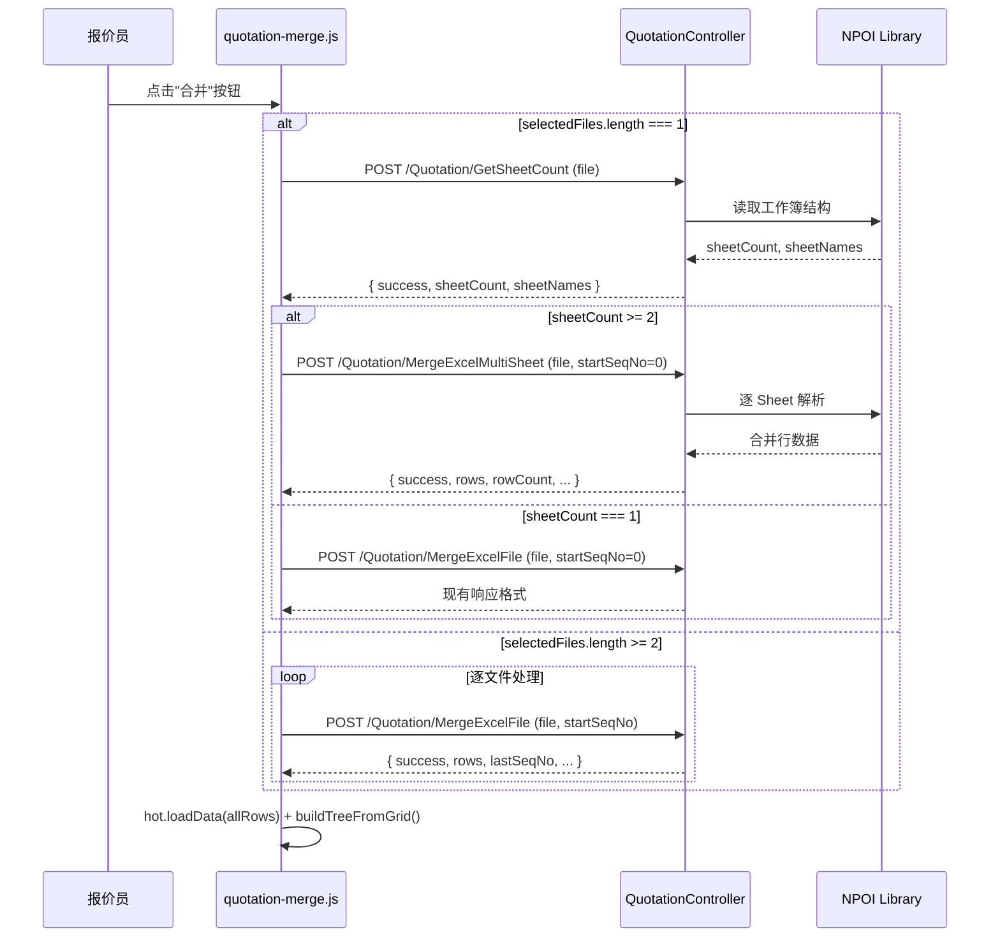
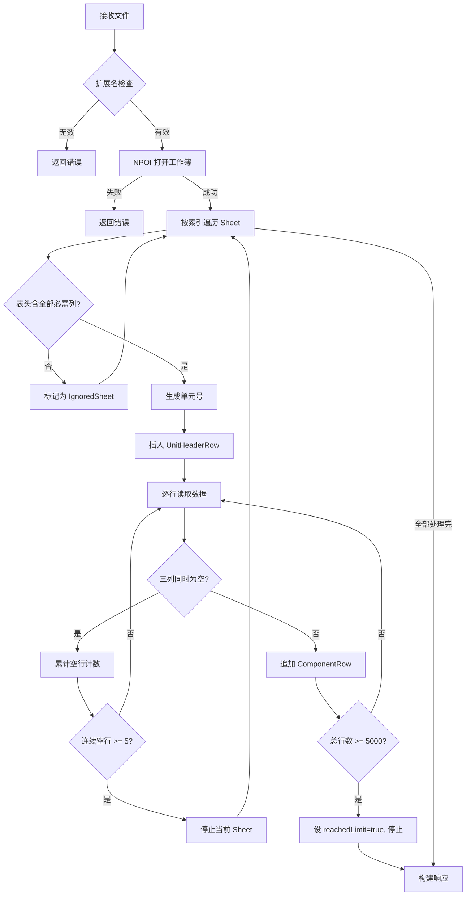

# Design Document: merge-excel-multisheet

## Overview

本设计文档描述在现有 `/Quotation/MergeExcel` 页面上新增"单文件多 Sheet"合并模式的技术方案。

**核心目标**：用户上传一个包含多个 Sheet 的 Excel 文件时，系统自动识别并逐一解析每个 Sheet，将结果合并到同一张 Handsontable 表格中，产出与"多文件合并"模式等价的结果。

**设计原则**：
- 复用现有页面布局、目录树、导出逻辑，最小化改动范围
- 后端新增两个独立 Action（不修改现有 `MergeExcelFile`），前端通过路由判断调用哪个接口
- 单元号唯一性由后端保证，前端无需额外处理
- 所有新增接口遵循现有安全规范（`[ValidateAntiForgeryToken]`、`[RoleAuthorize]`）

---

## Architecture



**分层职责**：

| 层 | 职责 |
|---|---|
| **View (MergeExcel.cshtml)** | 无改动，保持现有 HTML 结构 |
| **JS (quotation-merge.js)** | 新增路由判断逻辑、MultiSheet 请求发送、信息栏格式化 |
| **Controller (QuotationController)** | 新增 `GetSheetCount` 和 `MergeExcelMultiSheet` 两个 Action |
| **Core/Infrastructure** | 无改动（本功能不涉及数据库操作） |

---

## Components and Interfaces

### 后端新增接口

#### 1. GetSheetCount（辅助接口）

```csharp
[HttpPost]
[ValidateAntiForgeryToken]
public async Task<IActionResult> GetSheetCount(IFormFile? file)
```

**请求**：`multipart/form-data`，字段 `file`（IFormFile）

**响应**：
```json
// 成功
{ "success": true, "sheetCount": 3, "sheetNames": ["P101", "P102", "P103"] }
// 失败
{ "success": false, "message": "仅支持 .xls / .xlsx 文件" }
```

**实现要点**：
- 仅读取工作簿元数据（`workbook.NumberOfSheets`、`workbook.GetSheetName(i)`），不解析数据行
- 使用 `await Task.CompletedTask` 保持 async 签名一致性（NPOI 本身是同步 API）
- 异常捕获后记录日志，返回安全错误信息

#### 2. MergeExcelMultiSheet（多 Sheet 解析接口）

```csharp
[HttpPost]
[ValidateAntiForgeryToken]
public async Task<IActionResult> MergeExcelMultiSheet(IFormFile? file, [FromForm] int startSeqNo = 0)
```

**请求**：`multipart/form-data`，字段 `file`（IFormFile）+ `startSeqNo`（int）

**响应**：
```json
{
  "success": true,
  "rows": [["1", "P101", "", "", "0.0", "1", "", "0.0"], ["2", "", "断路器", "3P 63A", "0.0", "3", "正泰", "0.0"], ...],
  "rowCount": 150,
  "lastSeqNo": 150,
  "reachedLimit": false,
  "totalSheets": 5,
  "importedSheets": 4,
  "ignoredSheets": 1,
  "ignoredSheetNames": ["封面"]
}
```

**核心处理流程**：



### 前端改动（quotation-merge.js）

**新增逻辑位置**：`mergeExcelBtn` 的 click handler 内部

**改动范围**：
1. 在现有 `mergeExcelBtn.addEventListener("click", ...)` 中，当 `selectedFiles.length === 1` 时插入 SheetCount 检测分支
2. 新增 `handleMultiSheetMerge(file)` 函数处理多 Sheet 合并请求
3. 新增 `formatMultiSheetMessage(response)` 函数格式化信息栏文本

**不改动**：
- `buildTreeFromGrid()` — 复用现有逻辑
- `exportExcelBtn` handler — 导出逻辑不变
- `clearAllBtn` handler — 清空逻辑不变
- 离开提示逻辑 — 不变

---

## Data Models

### 后端数据结构

本功能不涉及数据库表操作，所有数据在内存中处理。

#### MultiSheetMergeResult（内部处理模型）

```csharp
// 不需要独立类，直接在 Action 内使用匿名类型返回 JSON
// 核心变量：
var rows = new List<List<string>>();       // 合并行列表，每行 8 列
var seqNo = startSeqNo;                    // 全局序号
var importedSheets = 0;                    // 成功导入的 Sheet 数
var ignoredSheets = 0;                     // 被忽略的 Sheet 数
var ignoredSheetNames = new List<string>(); // 被忽略 Sheet 的原始名称
var usedUnitCodes = new HashSet<string>(StringComparer.Ordinal); // 已使用的单元号（大小写敏感）
var allSheetNames = new List<string>();     // 所有 Sheet 原始名称（用于冲突检测）
```

#### 单元号生成算法

```
输入：sheetName（当前 Sheet 原始名称）、usedUnitCodes（已使用集合）、allSheetNames（所有原始名称）
输出：唯一单元号

1. 如果 sheetName 不在 usedUnitCodes 中 → 直接使用 sheetName
2. 否则，从 N=2 开始递增：
   a. 候选 = sheetName + "_" + N
   b. 如果候选不在 usedUnitCodes 中（大小写敏感）
      且候选不与任何 allSheetNames 匹配（大小写不敏感）
      → 使用候选
   c. 否则 N++，重复步骤 a
3. 将最终单元号加入 usedUnitCodes
```

#### 列映射规则

| 必需列名 | 可接受的变体 | 映射目标 |
|---------|------------|---------|
| `名称` | — | colName |
| `型号规格` | `规格型号`、`规格`、`型号` | colSpec |
| `数量` | — | colQty |
| `厂商` | `生产厂家` | colVendor |
| `备注` | — | colRemark |

### 前端状态变量

现有变量无需新增，复用：
- `selectedFiles: File[]` — 已选文件列表
- `hasMergedData: boolean` — 是否有合并数据
- `hasExported: boolean` — 是否已导出
- `unitRowMap: Map<string, number>` — 单元号→行索引映射

新增 URL 配置（从 `data-*` 属性读取）：
- `sheetCountUrl` — GetSheetCount 接口地址
- `multiSheetMergeUrl` — MergeExcelMultiSheet 接口地址

---

## Correctness Properties

*A property is a characteristic or behavior that should hold true across all valid executions of a system—essentially, a formal statement about what the system should do. Properties serve as the bridge between human-readable specifications and machine-verifiable correctness guarantees.*

### Property 1: Sheet 计数守恒

*For any* valid multi-sheet Excel file submitted to MergeExcelMultiSheet, the response SHALL satisfy: `importedSheets + ignoredSheets == totalSheets`, where totalSheets equals the actual number of sheets in the workbook.

**Validates: Requirements 2.8**

### Property 2: 单元号唯一性

*For any* multi-sheet Excel file (including files with duplicate sheet names), all UnitHeaderRows in the merge result SHALL have mutually distinct unit codes (case-sensitive comparison). No two UnitHeaderRows may share the same unit code value.

**Validates: Requirements 4.1, 4.2**

### Property 3: Sheet 处理顺序与 UnitHeaderRow 正确性

*For any* valid multi-sheet Excel file, the UnitHeaderRows in the merge result SHALL appear in the same order as the valid sheets' indices in the workbook (ascending from 0). Each UnitHeaderRow SHALL have: column 1 = sequence number string, column 2 = unit code (derived from sheet name), columns 3–8 = empty strings.

**Validates: Requirements 2.2, 2.4, 4.1**

### Property 4: 行过滤正确性

*For any* sheet with data rows, rows where colName, colSpec, and colQty are all empty SHALL be excluded from the merge result. Furthermore, if 5 consecutive rows have all three columns empty, no subsequent rows from that sheet SHALL appear in the result.

**Validates: Requirements 2.5, 2.6**

### Property 5: 行上限截断

*For any* multi-sheet Excel file whose total valid rows would exceed 5000, the merge result SHALL contain at most 5000 rows, `reachedLimit` SHALL be `true`, and `importedSheets` SHALL only count sheets whose data rows were fully processed before the 5000-row boundary was reached.

**Validates: Requirements 2.7**

### Property 6: 列检测决定 Sheet 有效性

*For any* sheet within a workbook, if its header row (row 0) does not contain all 5 required column names (名称, 型号规格/规格型号/规格/型号, 数量, 厂商/生产厂家, 备注), that sheet SHALL be classified as IgnoredSheet and produce zero merge rows. Conversely, if all 5 required columns are present, the sheet SHALL be classified as ValidSheet.

**Validates: Requirements 2.3**

### Property 7: SheetCount API 准确性

*For any* valid Excel file (.xls or .xlsx), the GetSheetCount endpoint SHALL return `sheetCount` equal to the actual number of sheets in the workbook, and `sheetNames` SHALL be an ordered list matching the workbook's sheet names by index.

**Validates: Requirements 3.2**

### Property 8: 行数单调递增

*For any* multi-sheet file with at least one valid sheet, each valid (non-ignored) sheet's processing SHALL increase the total row count by at least 1 (the UnitHeaderRow itself). The merge result's `rowCount` SHALL be strictly greater than 0 when `importedSheets > 0`.

**Validates: Requirements 2.4, 2.5**

### Property 9: 信息栏消息格式正确性

*For any* successful multi-sheet merge response, the info bar message SHALL contain the pattern `读取了 1 个文件，{totalSheets} 个 sheet 页，共 {importedSheets} 个控制柜/操作箱`. If `ignoredSheets > 0`, the message SHALL additionally contain `忽略 {ignoredSheets} 个 sheet：{names joined by 、}`. If `reachedLimit` is true, the message SHALL additionally contain `已达到 5000 行上限`.

**Validates: Requirements 6.1, 6.2, 6.3**

---

## Error Handling

### 后端错误处理策略

| 错误场景 | 处理方式 | 响应 |
|---------|---------|------|
| 文件为 null 或长度为 0 | 提前返回 | `{ success: false, message: "文件无法读取或不包含任何 Sheet" }` |
| 扩展名非 .xls/.xlsx | 提前返回 | `{ success: false, message: "仅支持 .xls / .xlsx 文件" }` |
| NPOI 打开文件异常 | catch + 日志 | `{ success: false, message: "文件无法读取或不包含任何 Sheet" }` |
| 所有 Sheet 均为 IgnoredSheet | 正常返回 | `{ success: true, rows: [], rowCount: 0, importedSheets: 0, ... }` |
| 解析过程中任意异常 | catch + `_logger.LogError` | `{ success: false, message: "Excel 解析失败，请检查文件格式" }` |

**关键原则**：
- 绝不向客户端暴露异常堆栈或内部路径
- 所有异常通过 `_logger.LogError(ex, ...)` 记录完整信息
- NPOI 的 `WorkbookFactory.Create()` 可能抛出 `IOException`、`RecordFormatException` 等，统一 catch `Exception`

### 前端错误处理策略

| 错误场景 | 处理方式 |
|---------|---------|
| GetSheetCount 超时（10s） | 信息栏显示"无法读取文件 Sheet 信息，请重试"，终止合并 |
| GetSheetCount 返回 success:false | 信息栏显示"无法读取文件 Sheet 信息，请重试"，终止合并 |
| GetSheetCount 网络异常 | 同上 |
| MergeExcelMultiSheet 返回 success:false | 信息栏显示后端 message |
| MergeExcelMultiSheet HTTP 非 2xx | 信息栏显示"合并请求失败，请检查网络或稍后重试" |
| MergeExcelMultiSheet 返回 rows 为空 | 信息栏显示"所有 Sheet 均缺少必需列，无有效数据导入" |

---

## Testing Strategy

### 测试框架选择

- **后端单元测试**：xUnit + Moq（与项目现有测试框架一致）
- **属性测试**：FsCheck.Xunit（C# 属性测试库，NuGet 包 `FsCheck.Xunit`）
- **前端测试**：手动集成测试（项目当前无前端自动化测试框架）

### 属性测试（Property-Based Testing）

每个属性测试配置最少 **100 次迭代**，使用 FsCheck 生成随机 Excel 文件内容。

**测试标签格式**：`Feature: merge-excel-multisheet, Property {N}: {property_text}`

**生成器设计**：
- `ArbitraryMultiSheetWorkbook`：生成包含 1–10 个 Sheet 的内存工作簿，每个 Sheet 随机包含/缺少必需列，数据行 0–100 行
- `ArbitrarySheetNames`：生成包含重复名称、特殊字符、空格的 Sheet 名称列表
- `ArbitraryDataRow`：生成随机元件行数据（含空值组合）

**属性测试覆盖**：
| Property | 测试方法 |
|----------|---------|
| Property 1 (计数守恒) | 生成随机工作簿 → 调用解析逻辑 → 验证等式 |
| Property 2 (单元号唯一) | 生成含重复名称的工作簿 → 验证所有 UnitCode 互不相同 |
| Property 3 (处理顺序) | 生成多 Sheet 工作簿 → 验证 UnitHeaderRow 顺序与 Sheet 索引一致 |
| Property 4 (行过滤) | 生成含空行模式的 Sheet → 验证过滤和截断行为 |
| Property 5 (行上限) | 生成大量数据行 → 验证 rows.Count ≤ 5000 |
| Property 6 (列检测) | 生成随机表头 → 验证 Valid/Ignored 分类正确 |
| Property 7 (SheetCount) | 生成随机工作簿 → 验证返回值与实际一致 |
| Property 8 (行数递增) | 生成含有效 Sheet 的工作簿 → 验证每个 Sheet 至少贡献 1 行 |
| Property 9 (消息格式) | 生成随机响应数据 → 验证消息字符串格式 |

### 单元测试（Example-Based）

| 测试场景 | 验证点 |
|---------|--------|
| 单文件 1 Sheet → 走 SingleFileApi | 路由判断正确 |
| 单文件 3 Sheet → 走 MultiSheetApi | 路由判断正确 |
| 多文件 → 不调用 GetSheetCount | 路由判断正确 |
| Sheet 名称含特殊字符（空格、中文、符号） | 单元号正确生成 |
| 文件扩展名为 .csv | 返回错误 |
| 空文件（0 字节） | 返回错误 |
| 所有 Sheet 缺少必需列 | rows 为空，ignoredSheets = totalSheets |
| 恰好 5000 行时停止 | reachedLimit = true |

### 集成测试

| 测试场景 | 验证点 |
|---------|--------|
| 未登录访问 GetSheetCount | 返回 401 |
| 无权限角色访问 MergeExcelMultiSheet | 返回 403 |
| 缺少 AntiForgeryToken | 返回 400 |
| 完整流程：上传 → 合并 → 导出 | 端到端验证 |

### 手动测试清单

| 场景 | 验证点 |
|------|--------|
| 上传含 5 个 Sheet 的 .xlsx 文件 | 信息栏显示正确统计 |
| 上传含重复 Sheet 名称的文件 | 目录树节点唯一，无"重复"标记 |
| 上传含 1 个有效 + 2 个无效 Sheet 的文件 | 忽略信息正确显示 |
| 合并后编辑表格再导出 | 导出内容包含编辑 |
| 合并后未导出点击菜单 | 离开提示弹出 |
| 移动端浏览器访问 | 页面无横向溢出 |
