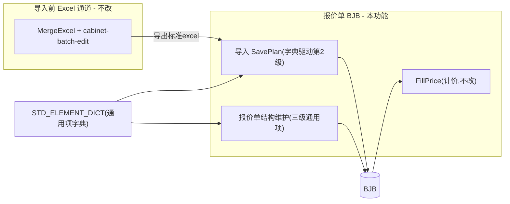
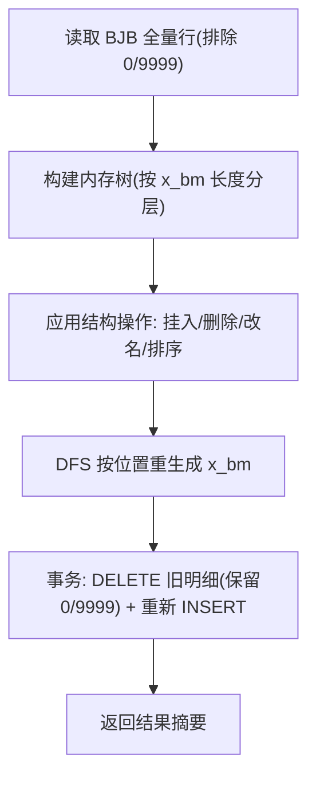

# Design Document: quotation-element-maintenance

## Overview

本设计实现报价单三级"通用项"的统一维护，由三块组成：

1. **通用项字典（主数据）**：新增表 `STD_ELEMENT_DICT` + `ElementDict` 维护页，登记三级可挂入的标准补充项。
2. **报价单结构维护（应用到 BJB）**：`Quotation/StructureMaintain` 页，选报价单 → 树形增删改排序通用项 → 经"按位置重编码"事务写回 `BJB`。
3. **导入去硬编码**：改造 `BuildRowsFromTable`，第 2 级节点由字典驱动生成。

核心复用一个领域原语 **TreeReencodeService**（按位置重编码），它等价于 PB 的"报价单重新排序"。**结构与计价分离**：本功能只动结构字段，价格仍由 FillPrice 录入。

### 与现有系统的关系



---

## Architecture

### 分层与文件清单

| 层 | 文件 | 类型 | 说明 |
|----|------|------|------|
| DB | `Docs/create-element-dict.sql` | 新增 | 建表 + 种子脚本 |
| Core/实体 | `PanelFlow.Infrastructure/Entities/StdElementDict.cs` | 新增 | 字典实体 |
| Core/接口 | `PanelFlow.Core/Interfaces/IElementDictService.cs` | 新增 | 字典服务接口 |
| Core/接口 | `PanelFlow.Core/Interfaces/IQuotationStructureService.cs` | 新增 | 结构维护服务接口 |
| Core/模型 | `PanelFlow.Core/Models/ElementDictDto.cs` | 新增 | 字典 DTO |
| Core/模型 | `PanelFlow.Core/Models/QuotationTreeNode.cs` | 新增 | 结构树节点模型 |
| Infra/数据 | `PanelFlow.Infrastructure/Data/ApplicationDbContext.cs` | 修改 | 注册 `DbSet<StdElementDict>` + 映射 |
| Infra/服务 | `PanelFlow.Infrastructure/Services/ElementDictService.cs` | 新增 | 字典 CRUD/排序/审计 |
| Infra/服务 | `PanelFlow.Infrastructure/Services/QuotationStructureService.cs` | 新增 | 构树 + TreeReencode + 写回 |
| Web/控制器 | `PanelFlow.Web/Controllers/ElementDictController.cs` | 新增 | 字典维护页与 API |
| Web/控制器 | `PanelFlow.Web/Controllers/QuotationController.cs` | 修改 | 新增结构维护 Action + 改造 `BuildRowsFromTable` |
| Web/视图 | `PanelFlow.Web/Views/ElementDict/Index.cshtml` | 新增 | 字典维护页 |
| Web/视图 | `PanelFlow.Web/Views/Quotation/StructureMaintain.cshtml` | 新增 | 结构维护页 |
| Web/前端 | `PanelFlow.Web/wwwroot/js/element-dict.js` | 新增 | 字典页交互（分级页签、拖拽排序、理由弹框） |
| Web/前端 | `PanelFlow.Web/wwwroot/js/quotation-structure.js` | 新增 | 结构维护交互（选单、树、多选挂入/删除） |
| Web/前端 | `PanelFlow.Web/wwwroot/css/quotation-structure.css` | 新增 | 结构维护页样式 |
| 权限 | `PanelFlow.Core/Services/PermissionService.cs` | 修改 | 注册两个新菜单 |

### 数据访问约定

- 沿用项目现状：常规 CRUD 用 EF Core `DbSet` + LINQ；`BJB` 批量删除/插入用 `ExecuteSqlInterpolatedAsync`（参数化，防注入）在事务内。
- 审计复用 `IAuditLogService.WriteAsync`。

---

## Data Models

### STD_ELEMENT_DICT（建表）

```sql
CREATE TABLE dbo.STD_ELEMENT_DICT (
    Id                INT IDENTITY(1,1) PRIMARY KEY,
    Level             TINYINT       NOT NULL,        -- 1/2/3
    Name              NVARCHAR(50)  NOT NULL,        -- 写入 BJB.x_mc
    Xlx               INT           NOT NULL,        -- 写入 BJB.x_lx；对齐汇总槽位
    Amount            DECIMAL(18,2) NOT NULL DEFAULT 1, -- 写入 BJB.x_sl
    Ggxh              NVARCHAR(50)  NULL,            -- 写入 BJB.x_ggxh（如散热风机 200mm）
    DefaultUnit       NVARCHAR(10)  NULL,            -- 写入 BJB.x_dw
    TargetParentScope NVARCHAR(8)   NULL,            -- L3 专用：挂到哪个 8 位分类，默认 '0001'(器件)
    SortOrder         INT           NOT NULL DEFAULT 0,
    IsDefaultOnImport BIT           NOT NULL DEFAULT 0,
    IsEnabled         BIT           NOT NULL DEFAULT 1,
    IsLocked          BIT           NOT NULL DEFAULT 0,
    Remark            NVARCHAR(300)  NULL,
    UpdatedAt         DATETIME2     NOT NULL DEFAULT SYSDATETIME(),
    UpdatedBy         NVARCHAR(50)  NULL
);
CREATE INDEX IX_STD_ELEMENT_DICT_Level_Sort ON dbo.STD_ELEMENT_DICT(Level, SortOrder);
```

种子数据（第 2 级，与现状等价）：

| Level | Name | Xlx | Amount | SortOrder | IsDefaultOnImport | IsLocked |
|-------|------|-----|--------|-----------|-------------------|----------|
| 2 | 器件 | 1 | 1 | 1 | 1 | 1 |
| 2 | 辅料 | 12 | 1 | 2 | 1 | 0 |
| 2 | 壳体 | 13 | 1 | 3 | 1 | 0 |
| 2 | 安装 | 14 | 1 | 4 | 1 | 0 |
| 2 | 包装 | 15 | 1 | 5 | 1 | 0 |
| 2 | 唛头 | 16 | 1 | 6 | 0 | 0 |
| 2 | 抽真空 | 17 | 1 | 7 | 0 | 0 |
| 2 | 干燥剂 | 18 | 1 | 8 | 0 | 0 |

第 1/3 级初始项后续按用户提供补充（第 1 级低优先）。

### StdElementDict 实体

```csharp
public class StdElementDict
{
    public int Id { get; set; }
    public byte Level { get; set; }
    public string Name { get; set; } = string.Empty;
    public int Xlx { get; set; }
    public decimal Amount { get; set; } = 1m;
    public string? Ggxh { get; set; }
    public string? DefaultUnit { get; set; }
    public string? TargetParentScope { get; set; }
    public int SortOrder { get; set; }
    public bool IsDefaultOnImport { get; set; }
    public bool IsEnabled { get; set; }
    public bool IsLocked { get; set; }
    public string? Remark { get; set; }
    public DateTime UpdatedAt { get; set; }
    public string? UpdatedBy { get; set; }
}
```

### QuotationTreeNode（运行时结构树，不持久化）

```csharp
public class QuotationTreeNode
{
    public string Xbm { get; set; } = string.Empty;   // 原始编码（重编码前）
    public string Name { get; set; } = string.Empty;  // x_mc
    public int Xlx { get; set; }
    public int Level => Xbm.Trim().Length / 4;          // 1/2/3
    public BjbRowSnapshot Data { get; set; } = new();   // 既有计价字段快照（保留写回）
    public List<QuotationTreeNode> Children { get; set; } = new();
}
```

`BjbRowSnapshot` 持有 `x_dj/x_bj_dj/x_bjb_bj/x_bjb_dj/x_fdds/x_sl/x_wzdh/x_sccj/...` 等需原样写回的字段。

---

## TreeReencodeService（核心原语）

等价于 PB `报价单重新排序`（`left(s1,(curjb-1)*4) + string(long(right(s1,4))+1,"0000")`），但为类型感知、守卫完整的新实现。

### 流程



### 关键规则

1. **构树**：按 `x_bm.Trim().Length` 分 4/8/12 三层，父子关系由编码前缀决定（8 位的前 4 位匹配某 4 位节点；12 位的前 8 位匹配某 8 位节点）。脏数据（长度非 4/8/12，或找不到父）归入"游离行"，原样保留写回但不参与重排，并记日志。
2. **挂入**：从字典构造新节点（字段映射见下），追加到目标父节点 `Children`，按 `SortOrder` 排序；同名/同 `x_lx` 已存在则跳过（幂等）。
3. **删除**：从父 `Children` 移除；器件锁定不可删；非器件第 2 级若 `Children` 非空（有元件）则拒绝。
4. **改名**：仅改节点 `Name`。
5. **排序**：仅重排 `Children` 顺序；器件强制保持第 2 级首位。
6. **重编码（DFS）**：
   - 第 1 级：父前缀为空，序号 `0001..` 按当前顺序分配。
   - 第 2 级：`{父4位}{0001..}`，器件固定 `0001`。
   - 第 3 级：`{父8位}{0001..}`。
   - 子节点编码在父编码确定后再生成，保证子树整体跟随。
7. **写回**：事务内 `DELETE FROM BJB WHERE fabh=@fabh AND x_bm NOT IN ('0','9999')`，再按重编码后的树逐节点 `INSERT`；计价字段取自 `BjbRowSnapshot`（既有节点）或默认值（新挂入节点）。沿用 `QuotationController.SavePlan` 的 INSERT 列清单与写法。

### 字典挂入字段映射

| 字典字段 | BJB 字段 | 说明 |
|----------|----------|------|
| `Name` | `x_mc` | 名称 |
| `SortOrder` | `x_bm` | 同级按 SortOrder 排序后，经 DFS 重编码生成（器件 L2 仍固定 `0001`） |
| `Xlx` | `x_lx` | 类型/汇总身份 |
| `Ggxh` | `x_ggxh` | 规格型号 |
| `Amount` | `x_sl` | 默认数量 |
| `DefaultUnit` | `x_dw` | 单位 |
| 默认 0 | `x_dj`/`x_bj_dj`/... | 其余计价字段默认值，待 FillPrice |

---

## Components and Interfaces

### IElementDictService

```csharp
public interface IElementDictService
{
    Task<IReadOnlyList<ElementDictDto>> GetByLevelAsync(byte level, bool includeDisabled);
    Task<int> CreateAsync(ElementDictDto dto, string userName);
    Task UpdateAsync(ElementDictDto dto, string userName);
    Task ToggleEnableAsync(int id, bool enabled, string userName);
    Task ReorderAsync(byte level, IReadOnlyList<int> orderedIds, string reason, string userName); // 写审计；器件锁定守卫
}
```

### IQuotationStructureService

```csharp
public interface IQuotationStructureService
{
    Task<QuotationStructureDto> GetTreeAsync(string fabh);
    Task<StructureApplyResult> ApplyAsync(StructureApplyRequest request, string userName); // 事务 + 重编码 + 审计
}
```

`StructureApplyRequest` 描述一批操作（挂入/删除/改名/排序），后端在内存树上应用后统一重编码写回。

### ElementDictController（新增）

- `[RoleAuthorize(Admin, Quoter, ProductionManager)]`
- `GET Index`、`GET GetByLevel(level)`、`POST Create`、`POST Update`、`POST ToggleEnable`、`POST Reorder`（全部 `[ValidateAntiForgeryToken]`）。

### QuotationController（修改）

- 新增 `GET StructureMaintain`、`GET GetQuotationTree(fabh)`、`POST ApplyStructure`（防伪 + 权限 `dqzt!=10` + 报价人本人/管理员）。
- 改造 `BuildRowsFromTable`：注入 `IElementDictService`（或在 `SavePlan` 内预读字典 Level=2 默认项列表传入），替换写死的 5 行 `CreateFixedNode`。
  - 注意 `BuildRowsFromTable` 当前为 `internal static`（PBT 使用）。改造方案：将默认第 2 级节点列表作为参数注入（`IReadOnlyList<(string Name,int Xlx)> defaultLevel2Nodes`），保持纯函数可测；由 `SavePlan` 从字典查出后传入。PBT 相应更新为传入等价默认列表。

---

## 菜单注册（PermissionService）

在 `BuildAllMenus()` 的"项目管理" `Children` 中追加：

```csharp
new() { Title = "通用项字典", Icon = "bi-collection", Url = "/ElementDict/Index", AllowedRoles = [.. quoterRoles] },
new() { Title = "报价单结构维护", Icon = "bi-diagram-3", Url = "/Quotation/StructureMaintain", AllowedRoles = [.. quoterRoles] },
```

---

## 前端设计

### ElementDict/Index.cshtml + element-dict.js

- 三个页签（第 1/2/3 级）。每页签一个表格：名称、x_lx、数量、规格型号、单位、启用、排序、操作。
- 新增时按级别预填默认值：第 1 级 `x_lx=1`、第 3 级 `x_lx=11`、各级 `Amount=1`；第 2 级类型由用户指定。
- 拖拽排序（SortableJS 或上移/下移按钮）；点击"保存顺序"弹出理由输入框，理由非空才提交 `POST Reorder`。
- 器件行显示锁定图标，禁用拖拽与删除。
- 新增/编辑用 Bootstrap Modal；服务端 `DataAnnotations` 校验 + 前端基本校验。

### Quotation/StructureMaintain.cshtml + quotation-structure.js + .css

- 顶部：报价单检索框（`GET SearchQuotations`，`WhereOwnerOperable` = `QuotationEditRules.CanOwnerOperate`），选中后加载结构树。
- 左侧：结构树顶为合成根节点（显示 `BJFAT.famc` 报价单名称，code=`__ROOT__`）；其下为 4/8/12 三层，节点带 checkbox；元件行只读、置灰。
- 树工具栏：全选/反选控制柜、全部展开/折叠、刷新；默认折叠到第 1 级（仅显示控制柜行）；Shift+点击实现控制柜范围多选。
- 右侧操作面板——
  - 选中根节点 → 挂入第 1 级扩展项（字典 Level=1，`AddLevel1`）。
  - 选中一个或多个控制柜 → 批量操作区：同时勾选 L2/L3 字典，一次提交 `AddLevel2`+`AddLevel3` 或 `RemoveLevel2ByDict`+`RemoveLevel3ByDict`。
  - 选中第 2 级节点 → 挂入第 3 级、"删除"、"改名"、同级排序。
  - 选中第 3 级节点 → "删除"、"改名"。
- 提交 `POST ApplyStructure`（带防伪），成功后用返回摘要（含跳过明细）刷新树与信息栏。
- `dqzt==10` 时全树只读、操作按钮禁用。

---

## Error Handling

| 场景 | 处理 |
|------|------|
| 报价单不存在 / fabh 空 | 拒绝，提示无效报价单 |
| `dqzt==10` 或非本人/非管理员写操作 | 拒绝，提示无权限/已成立 |
| 删除器件节点 | 拒绝，提示"器件为锁定节点" |
| 删除有元件的第 2 级节点 | 拒绝，提示先处理元件 |
| 排序移动器件出首位 | 拒绝，提示器件固定首位 |
| 理由为空（排序） | 拒绝，提示填写理由 |
| 挂入已存在同级同名/同 x_lx | 跳过并计入摘要 |
| 批量移除 L2 且属性下有元件 | 跳过该柜，摘要列出柜名 |
| 批量移除 L3 | 按名称+规格型号匹配（同名同规格导入元件一并删除） |
| 第 3 级挂入但目标柜无器件分类 | 拒绝并提示 |
| 事务中任一步失败 | 整体回滚，返回失败原因 |
| BJB 游离/脏数据行 | 原样保留写回，不参与重排，记日志 |

---

## Testing Strategy

### 单元 / 属性测试（Core/Infrastructure，xUnit + 现有 PBT 框架）

- **TreeReencode 正确性**：
  - P1：重编码后任一第 N 级节点编码 = 父编码 + 4 位序号，且同级序号从 `0001` 连续无重复。
  - P2：器件节点恒为其父柜下 `0001`。
  - P3：删除中间节点后，后续兄弟编码连续重排；其 12 位子节点编码全部跟随父节点变化（无孤立）。
  - P4：写回保留既有节点计价字段（快照前后相等）。
  - P5：挂入幂等——重复挂入同名/同 x_lx 不增加行数。
- **BuildRowsFromTable（改造后）**：传入等价默认第 2 级列表时，输出与改造前一致（回归）。
- **ReorderAsync 守卫**：器件移出首位被拒；理由为空被拒。

### 集成测试（PanelFlow.Web.Tests）

- 构造含 2 柜、若干元件的 `BJB`，调用 `ApplyAsync` 挂入第 2/3 级，断言写回行与编码。
- `dqzt==10` 拒绝写。
- 审计日志写入断言。

---

## 实施阶段（与 plan 对齐）

1. **Phase 1**：建表+种子；`StdElementDict` 实体/`DbSet`；`ElementDictService` + `ElementDictController` + 字典页；导入去硬编码（第 2 级）+ PBT 更新；菜单"通用项字典"。
2. **Phase 2**：`QuotationStructureService`（TreeReencode）+ 结构维护 Action/页面；覆盖第 2/3 级；菜单"报价单结构维护"。
3. **Phase 3（低优先）**：第 1 级通用项接入（运费/保费等，沿用不区分类型）。
4. 汇总报表：另立项，不在本规格。

---

## 兼容性与风险

- **不改历史表结构**；新增表独立，PB 并行安全。
- **x_lx ↔ 汇总槽位**：约 10 槽上限，新增类别在界面/文档提示。
- **整树重编码**：仅影响目标报价单；严格事务、保留计价字段；脏数据防御。
- **`BuildRowsFromTable` 可测性**：以参数注入默认列表方式保持纯函数与 PBT 兼容。
- 全程异步、防伪、审计，遵循 `coding-standards.mdc` / `db-compatibility.mdc`。
