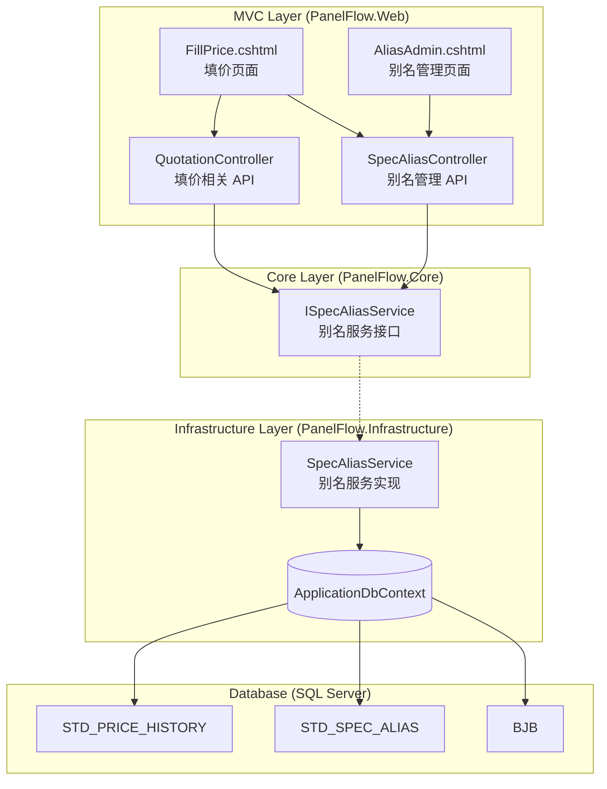
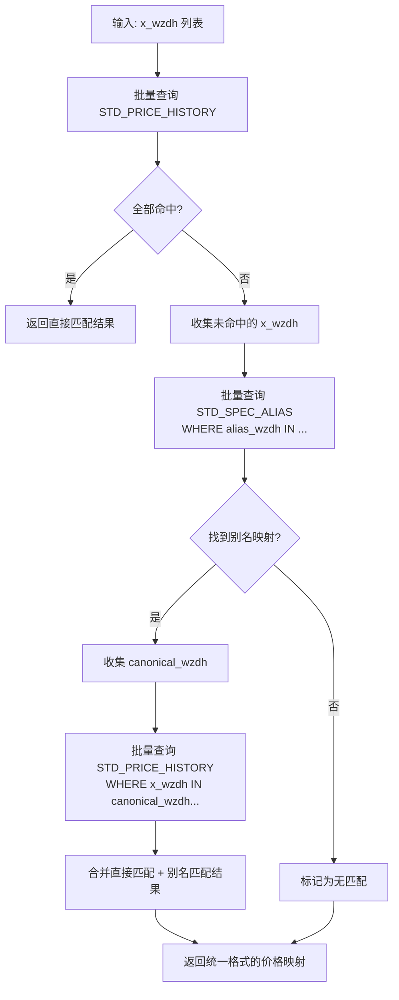

# Design Document: 指纹别名匹配 (spec-alias-matching)

## Overview

本功能在现有自动填价系统基础上引入二级匹配机制。当元件的标准化指纹（x_wzdh）在 STD_PRICE_HISTORY 中无直接匹配时，系统通过 STD_SPEC_ALIAS 别名表查找对应的标准指纹（canonical_wzdh），再用标准指纹获取历史价格。

核心设计目标：
- **最小侵入**：在现有 `AutoFillPriceFromHistory` 和 `GetReferencePrice` 逻辑中插入别名回退步骤，不改变已有匹配行为
- **批量高效**：别名查询使用 IN 批量操作，避免 N+1 查询
- **全局共享**：别名映射一旦创建，所有报价单均可受益
- **严格校验**：通过多重验证规则确保别名数据质量

## Architecture



### 设计决策

1. **独立 Service 层**：别名逻辑提取为 `ISpecAliasService` / `SpecAliasService`，因为它被 QuotationController（填价）和 SpecAliasController（管理）两个 Controller 共用，符合编码规范中"跨多个 Controller 复用的逻辑建议提取到 Service 层"的原则。

2. **独立 Controller**：别名管理页面（admin）使用独立的 `SpecAliasController`，与 QuotationController 职责分离。填价页面中的别名创建 API 也放在 SpecAliasController 中，QuotationController 仅调用 Service 层的匹配方法。

3. **匹配逻辑内聚**：二级匹配逻辑封装在 `SpecAliasService.ResolvePricesWithFallbackAsync()` 中，QuotationController 的 `AutoFillPriceFromHistory` 和 `GetReferencePrice` 调用同一方法，确保行为一致。

## Components and Interfaces

### ISpecAliasService (Core 层接口)

```csharp
namespace PanelFlow.Core.Interfaces;

public interface ISpecAliasService
{
    /// <summary>
    /// 二级匹配：先直接查 STD_PRICE_HISTORY，未命中的再通过别名回退查找。
    /// 返回 wzdh → price 的映射字典。
    /// </summary>
    Task<Dictionary<string, PriceMatchResult>> ResolvePricesWithFallbackAsync(
        IReadOnlyList<string> wzdhList);

    /// <summary>
    /// 创建别名映射，包含所有验证逻辑。
    /// </summary>
    Task<(bool Success, string Message, PriceMatchResult? Price)> CreateAliasAsync(
        string aliasWzdh, string canonicalWzdh, string? remark, string createdBy);

    /// <summary>
    /// 搜索 STD_PRICE_HISTORY，支持按 ggxh/x_mc 模糊匹配。
    /// </summary>
    Task<List<PriceSearchResult>> SearchPriceHistoryAsync(string keyword);

    /// <summary>
    /// 获取未映射指纹列表（分页）。
    /// </summary>
    Task<PagedResult<UnmappedFingerprintDto>> GetUnmappedFingerprintsAsync(
        string? keyword, int page, int pageSize);

    /// <summary>
    /// 获取已创建别名列表（分页）。
    /// </summary>
    Task<PagedResult<SpecAliasDto>> GetAliasListAsync(int page, int pageSize);

    /// <summary>
    /// 删除别名映射。
    /// </summary>
    Task<(bool Success, string Message)> DeleteAliasAsync(int id);

    /// <summary>
    /// 批量创建别名映射。
    /// </summary>
    Task<BatchCreateResult> BatchCreateAliasAsync(
        IReadOnlyList<string> aliasWzdhList, string canonicalWzdh, 
        string? remark, string createdBy);
}
```

### SpecAliasController (MVC 层)

```csharp
[Route("SpecAlias")]
public class SpecAliasController : Controller
{
    // POST /SpecAlias/Create - 创建别名（填价页面 + 管理页面共用）
    // GET  /SpecAlias/Search?keyword=xxx - 搜索历史价格
    // GET  /SpecAlias/Admin - 别名管理页面（仅管理员）
    // GET  /SpecAlias/UnmappedList - 未映射指纹列表 API
    // GET  /SpecAlias/AliasList - 已创建别名列表 API
    // POST /SpecAlias/Delete - 删除别名
    // POST /SpecAlias/BatchCreate - 批量创建别名
}
```

### QuotationController 修改

现有 `AutoFillPriceFromHistory` 和 `GetReferencePrice` 方法中，在直接查询 STD_PRICE_HISTORY 后，对未命中的指纹集合调用 `ISpecAliasService.ResolvePricesWithFallbackAsync()`，将别名匹配结果合并到最终价格映射中。

### 二级匹配流程



## Data Models

### 新增实体：StdSpecAlias

```csharp
namespace PanelFlow.Infrastructure.Entities;

public class StdSpecAlias
{
    public int Id { get; set; }
    public string alias_wzdh { get; set; } = string.Empty;
    public string canonical_wzdh { get; set; } = string.Empty;
    public string? created_by { get; set; }
    public DateTime created_at { get; set; }
    public string? remark { get; set; }
}
```

### EF Core 配置

```csharp
modelBuilder.Entity<StdSpecAlias>(entity =>
{
    entity.ToTable("STD_SPEC_ALIAS");
    entity.HasKey(e => e.Id);
    entity.Property(e => e.Id).ValueGeneratedOnAdd();
    entity.HasIndex(e => e.alias_wzdh).IsUnique();
    entity.HasIndex(e => e.canonical_wzdh);
    entity.Property(e => e.alias_wzdh).HasColumnType("nvarchar(400)").IsRequired();
    entity.Property(e => e.canonical_wzdh).HasColumnType("nvarchar(400)").IsRequired();
    entity.Property(e => e.created_by).HasColumnType("nvarchar(50)");
    entity.Property(e => e.created_at).HasColumnType("datetime").HasDefaultValueSql("GETDATE()");
    entity.Property(e => e.remark).HasColumnType("nvarchar(200)");
});
```

### 建表 SQL

```sql
CREATE TABLE STD_SPEC_ALIAS (
    id            INT IDENTITY(1,1) PRIMARY KEY,
    alias_wzdh    NVARCHAR(400) NOT NULL,
    canonical_wzdh NVARCHAR(400) NOT NULL,
    created_by    NVARCHAR(50),
    created_at    DATETIME DEFAULT GETDATE(),
    remark        NVARCHAR(200)
);

CREATE UNIQUE INDEX UX_STD_SPEC_ALIAS_alias ON STD_SPEC_ALIAS(alias_wzdh);
CREATE INDEX IX_STD_SPEC_ALIAS_canonical ON STD_SPEC_ALIAS(canonical_wzdh);
```

### DTO 模型

```csharp
// Core/Models/PriceMatchResult.cs
public class PriceMatchResult
{
    public decimal LastPrice { get; set; }
    public decimal? AvgPrice { get; set; }
}

// Core/Models/PriceSearchResult.cs
public class PriceSearchResult
{
    public string Wzdh { get; set; } = string.Empty;
    public string? Name { get; set; }
    public string? Spec { get; set; }
    public decimal LastPrice { get; set; }
    public decimal? AvgPrice { get; set; }
    public string? Vendor { get; set; }
    public int AvgCount { get; set; }
}

// Core/Models/UnmappedFingerprintDto.cs
public class UnmappedFingerprintDto
{
    public string Wzdh { get; set; } = string.Empty;
    public string? SampleSpec { get; set; }
    public string? SampleName { get; set; }
    public int OccurrenceCount { get; set; }
}

// Core/Models/SpecAliasDto.cs
public class SpecAliasDto
{
    public int Id { get; set; }
    public string AliasWzdh { get; set; } = string.Empty;
    public string CanonicalWzdh { get; set; } = string.Empty;
    public string? CanonicalSpec { get; set; }
    public string? CreatedBy { get; set; }
    public DateTime CreatedAt { get; set; }
}

// Core/Models/BatchCreateResult.cs
public class BatchCreateResult
{
    public int SuccessCount { get; set; }
    public int FailureCount { get; set; }
    public List<string> Errors { get; set; } = new();
}
```

## Correctness Properties

*A property is a characteristic or behavior that should hold true across all valid executions of a system—essentially, a formal statement about what the system should do. Properties serve as the bridge between human-readable specifications and machine-verifiable correctness guarantees.*

### Property 1: Two-level matching correctness

*For any* set of fingerprints, the `ResolvePricesWithFallbackAsync` method SHALL return: (a) the direct STD_PRICE_HISTORY price for fingerprints that exist there, (b) the alias-resolved price for fingerprints that have a mapping in STD_SPEC_ALIAS whose canonical_wzdh exists in STD_PRICE_HISTORY, and (c) no result for fingerprints with neither direct nor alias match.

**Validates: Requirements 2.1, 2.2, 2.3, 2.4**

### Property 2: Direct match takes priority over alias

*For any* fingerprint that exists in both STD_PRICE_HISTORY directly and has an alias mapping in STD_SPEC_ALIAS, the system SHALL return the direct match price, not the alias-resolved price.

**Validates: Requirements 2.3**

### Property 3: Alias creation validation — duplicate rejection

*For any* alias_wzdh that already exists in STD_SPEC_ALIAS, attempting to create another mapping with the same alias_wzdh SHALL be rejected regardless of the canonical_wzdh value.

**Validates: Requirements 1.4, 5.4**

### Property 4: Alias creation validation — canonical must exist in price history

*For any* canonical_wzdh value that does NOT exist as x_wzdh in STD_PRICE_HISTORY, attempting to create an alias mapping SHALL be rejected.

**Validates: Requirements 1.5, 5.2**

### Property 5: Alias creation validation — whitespace and self-reference rejection

*For any* alias creation request where alias_wzdh or canonical_wzdh is empty/whitespace-only, OR where alias_wzdh equals canonical_wzdh, the system SHALL reject the creation.

**Validates: Requirements 1.6, 1.7, 5.3**

### Property 6: Alias creation validation — alias already has direct price

*For any* alias_wzdh that already exists as x_wzdh in STD_PRICE_HISTORY (i.e., it already has a direct price match), attempting to create an alias mapping for it SHALL be rejected.

**Validates: Requirements 1.8**

### Property 7: Search results correctness

*For any* non-empty keyword, the search results from `SearchPriceHistoryAsync` SHALL only contain records where ggxh or x_mc contains the keyword (case-insensitive), SHALL be ordered by avg_count descending, and SHALL contain at most 50 records.

**Validates: Requirements 4.2, 4.4, 9.1, 9.3**

### Property 8: Unmapped fingerprint identification

*For any* set of BJB records (x_lx=11, x_wzdh non-empty), the unmapped fingerprint list SHALL contain exactly those x_wzdh values that exist in BJB but do NOT exist in STD_PRICE_HISTORY (as x_wzdh) and do NOT exist in STD_SPEC_ALIAS (as alias_wzdh), ordered by occurrence count descending.

**Validates: Requirements 7.1, 7.3, 10.1**

### Property 9: Batch assignment partial failure handling

*For any* batch of alias creation requests, the system SHALL create all valid mappings and skip invalid ones, returning a success count equal to the number of valid items and a failure count equal to the number of invalid items, with the sum equaling the total batch size.

**Validates: Requirements 8.4, 8.5**

### Property 10: Matching result consistency

*For any* set of component fingerprints, the two-level matching logic used by `AutoFillPriceFromHistory` and `GetReferencePrice` SHALL produce identical price results (same last_price, avg_price) for the same x_wzdh input.

**Validates: Requirements 2.5, 2.7**

## Error Handling

### 别名创建错误

| 场景 | HTTP 状态码 | 错误信息 |
|------|------------|---------|
| alias_wzdh 或 canonical_wzdh 为空/空白 | 400 | "指纹值不能为空" |
| alias_wzdh == canonical_wzdh | 400 | "变体指纹不能与标准指纹相同" |
| canonical_wzdh 不在 STD_PRICE_HISTORY 中 | 400 | "目标标准指纹在历史价格表中不存在" |
| alias_wzdh 已在 STD_PRICE_HISTORY 中 | 400 | "该指纹已有直接价格记录无需创建别名" |
| alias_wzdh 已在 STD_SPEC_ALIAS 中 | 409 | "该变体指纹已存在别名映射" |
| 未登录 | 401 | "登录已失效，请重新登录" |
| 无权限 | 403 | "仅报价人本人或管理员可创建别名" |

### 搜索接口错误

| 场景 | HTTP 状态码 | 处理 |
|------|------------|------|
| keyword 为空/空白 | 200 | 返回空列表 `[]` |
| 未登录 | 401 | 重定向登录 |

### 别名删除错误

| 场景 | HTTP 状态码 | 错误信息 |
|------|------------|---------|
| 记录不存在 | 404 | "别名记录不存在" |
| 非管理员 | 403 | 重定向无权限页面 |

### 前端错误处理

- 网络错误：搜索对话框内显示"网络错误，请稍后重试"
- 服务端返回错误：搜索对话框内显示服务端返回的 message 字段
- 创建失败：保留对话框打开状态，显示错误信息，不关闭
- 创建成功：关闭对话框，更新表格行，信息栏显示成功提示

## Testing Strategy

### Property-Based Testing

本功能的核心逻辑（验证规则、匹配算法、搜索排序）适合使用属性测试验证正确性。

**PBT 库选择**：FsCheck（C# 生态中成熟的 PBT 库，与 xUnit 集成良好）

**配置要求**：
- 每个属性测试最少运行 100 次迭代
- 每个测试标注对应的设计文档属性编号
- 标注格式：`// Feature: spec-alias-matching, Property {N}: {description}`

**测试范围**：
- `SpecAliasService.ResolvePricesWithFallbackAsync()` — 二级匹配逻辑（Property 1, 2, 10）
- `SpecAliasService.CreateAliasAsync()` — 验证规则（Property 3, 4, 5, 6）
- `SpecAliasService.SearchPriceHistoryAsync()` — 搜索正确性（Property 7）
- `SpecAliasService.GetUnmappedFingerprintsAsync()` — 未映射查询（Property 8）
- `SpecAliasService.BatchCreateAliasAsync()` — 批量处理（Property 9）

### Unit Tests (Example-Based)

- 权限校验：不同角色访问各接口的行为
- UI 交互：关联按钮显示/隐藏条件
- 边界条件：空关键词搜索、删除不存在的记录
- 前端 JavaScript：对话框打开/关闭、加载状态、错误显示

### Integration Tests

- 全局生效：在一个报价单创建别名后，另一个报价单能通过别名匹配到价格
- 价格更新传播：STD_PRICE_HISTORY 刷新后，别名匹配自动获取新价格
- 批量填价性能：大量元件行的二级匹配查询性能验证

### 测试数据策略

- 使用内存数据库（SQLite in-memory）或 EF Core InMemory provider 进行 Service 层单元测试
- PBT 生成器生成随机指纹字符串（模拟 NormalizeSpec 输出格式：小写字母+数字+中文）
- 集成测试使用独立的 SQL Server 测试数据库
