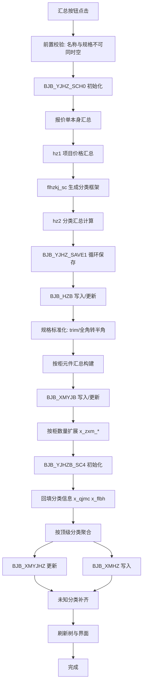

# PB9 报价单“重新排序/汇总”流程分析与关系图

本文整理两个按钮的 PB9 代码逻辑：

- `pb9-报价单重新排序.txt`
- `pb9-报价单汇总.txt`

用于后续 C# 重构时的流程对齐与数据核对。

---

## 一、重新排序按钮（`pb9-报价单重新排序.txt`）

### 1) 目标

对当前报价单的树形编码 `x_bm` 进行重排，使编码层级与顺序连续、规范。

### 2) 核心流程

1. 显示进度文本，创建并检索 `dw_bjd_bjdselebh` DataStore。
2. 记录数过少（`<2`）直接退出。
3. 以第 2 行为起点，强制设置首个编码为 `0001`。
4. 从第 3 行到倒数第 2 行遍历，按 `len(x_bm)/4` 计算层级：
   - 当前层级比上一层深：新编码 = 上一节点编码 + `0001`
   - 同级或上浮：先回退层级，再对当前层最后 4 位 +1
5. `hzb.update()` 写回数据库；失败回滚，成功提交。
6. 刷新报价单树与界面（`fab.retrieve`、`loadfamx`、`dw_1.retrieve`）。

### 3) 结果

- 只改树编码顺序（`x_bm`），不直接改价格/数量业务值。
- 用于纠正树结构错位、编码断档等问题。

---

## 二、汇总按钮（`pb9-报价单汇总.txt`）

### 1) 总体目标

将 `BJB` 明细转换为多层汇总结果，包括：

- 报价单整体分类汇总（写入/更新 `BJB_HZB`）
- 项目元件按柜汇总（`BJB_XMYJB`）
- 项目元件分类汇总（`BJB_XMYJHZ` / `BJB_XMHZ`）

### 2) 分阶段流程

#### 阶段 A：前置检查

1. 检查是否存在 `x_lx=11` 且 `x_mc`、`x_ggxh` 同时为空的器件。
2. 命中后弹警告：允许用户继续（但提示汇总可能不完整）或取消。

#### 阶段 B：初始化

1. 调用存储过程 `BJB_YJHZ_SCH0`（通过 `DECLARE ... FOR` + `EXECUTE`）。
2. 失败回滚并退出；成功提交。

#### 阶段 C：报价单本身汇总

1. 加载规格/类型 DataStore（`bzb`、`wyb`、`hzlx`、`jcb`、`hzb`）。
2. 执行 `hz1()`（项目价格汇总）。
3. 生成分类汇总框架 `flhzkj_sc()`。
4. 执行 `hz2()`（分类汇总计算）。
5. 循环 `flhzhzb`，将每行映射到 34 个参数，调用 `BJB_YJHZ_SAVE1` 保存。
6. 复制 `x_bm='0'` 的汇总行为 `x_bm='9999'`（总览节点）。

#### 阶段 D：项目元件按柜汇总

1. 先标准化规格：
   - `trim(x_ggxh)`
   - 空规格回退为名称
   - 全角 `－` 转半角 `-`
2. 读取源集 `dw_bjb_xmhz_src1`，写入目标 `dw_bjb_xmhz_1`（表 `BJB_XMYJB`）。
3. 按“柜号 + 规格 + 厂家 + 关键人员 + 类型”聚合：
   - 同型号累计数量/金额
   - 不同型号插入新行
4. 按柜数量对项目总量做扩展更新：
   - `x_zxm_sl = x_zsl * kk`
   - `x_zxm_je = x_zje * kk`
   - `x_zxm_bcg_sl = x_bcg_sl * kk`

#### 阶段 E：项目元件分类汇总

1. 存储过程初始化：`BJB_YJHZB_SC4`。
2. 通过 `x_ggxh + x_sccj + x_key_ry` 回填分类信息（`x_qjmc`、`x_flbh`）。
3. 按顶级分类（`left(x_bh,4)`）汇总数量/金额/不采购数量，写入 `bjb_xmhz`。
4. 处理未知分类（`x_flbh` 或 `x_hzjb` 为空）并补汇总记录。

#### 阶段 F：收尾刷新

1. 成功提示“器件分类汇总成功”。
2. 重新检索并刷新树与 DataWindow：
   - `fab.retrieve`
   - `loadfamx`
   - `dw_1.retrieve`

---

## 三、关系图（数据流/过程流）

---

## 四、重构对齐建议（给 C#）

1. 保持“分阶段提交 + 失败回滚”的边界，不要把所有环节混成单事务黑盒。
2. 规格标准化（全角横杠到半角）是汇总准确率关键，建议抽成独立纯函数并可测试。
3. “按柜汇总”与“按分类汇总”建议拆成两个应用服务，便于回归与对账。
4. 对未知分类保留与 PB 一致的兜底策略，避免统计总量丢失。

