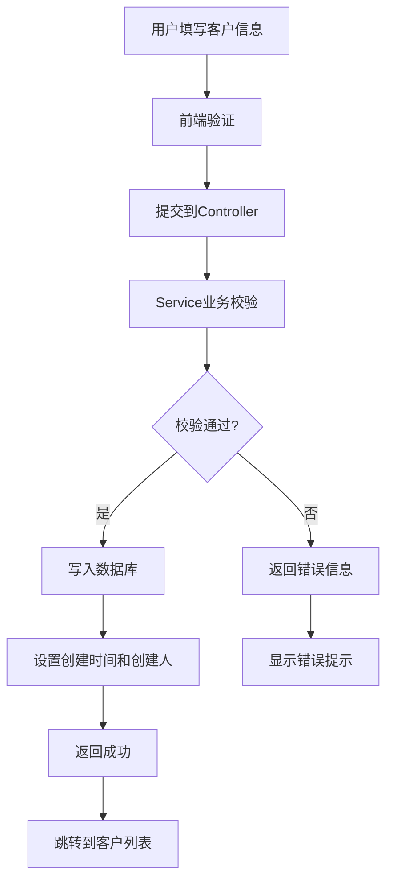
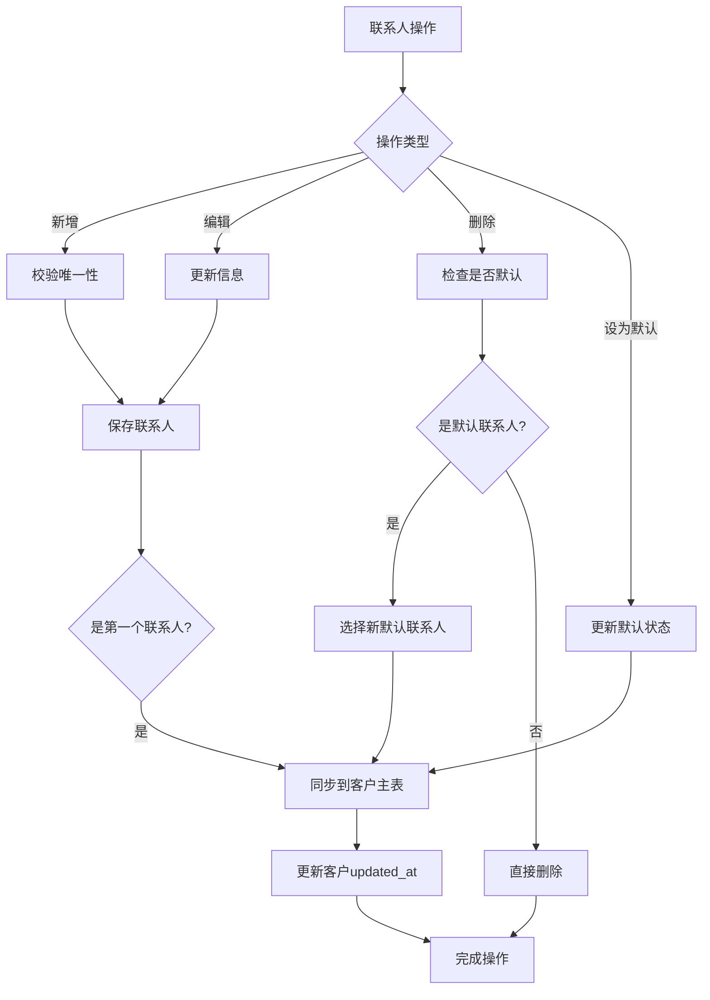
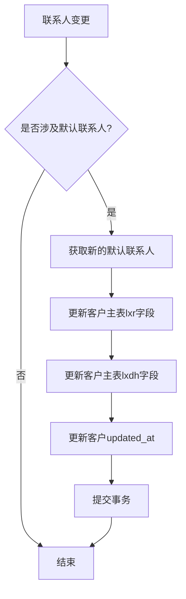

# 客户管理功能设计文档

## 1. 系统架构

### 1.1 分层架构
```
┌─────────────────┐
│   Presentation  │  CustomerController, Views
├─────────────────┤
│    Business     │  CustomerService, CustomerContactService
├─────────────────┤
│  Infrastructure │  ApplicationDbContext, Entities
└─────────────────┘
```

### 1.2 核心组件
- **CustomerController**：客户管理控制器，处理 HTTP 请求
- **CustomerService**：客户业务逻辑服务
- **CustomerContactService**：联系人业务逻辑服务
- **KhylbCustomer**：客户数据实体
- **KhylbCustomerContact**：联系人数据实体

### 1.3 依赖关系
```
CustomerController
    ├── ICustomerService
    ├── ICustomerContactService
    └── IQuotationService

CustomerService
    └── ApplicationDbContext

CustomerContactService
    └── ApplicationDbContext
```

## 2. 数据库设计

### 2.1 客户主表（KHYLB）
```sql
CREATE TABLE KHYLB (
    gsbh VARCHAR(10) PRIMARY KEY,      -- 公司编号
    gsmc VARCHAR(50) NOT NULL,         -- 公司名称
    gsld VARCHAR(10),                  -- 公司别名
    lxr VARCHAR(100),                  -- 联系人（镜像字段）
    lxdh VARCHAR(40),                  -- 联系电话（镜像字段）
    beizhu VARCHAR(100),               -- 备注
    created_at DATETIME,               -- 创建时间
    updated_at DATETIME,               -- 更新时间
    created_by VARCHAR(50),            -- 创建人
    updated_by VARCHAR(50)             -- 更新人
);

-- 索引设计
CREATE INDEX IX_KHYLB_gsmc ON KHYLB(gsmc);
CREATE INDEX IX_KHYLB_gsld ON KHYLB(gsld);
CREATE INDEX IX_KHYLB_updated_at ON KHYLB(updated_at);
```

### 2.2 联系人表（KHYLB_CONTACT）
```sql
CREATE TABLE KHYLB_CONTACT (
    Id INT IDENTITY(1,1) PRIMARY KEY,  -- 主键
    gsbh VARCHAR(10) NOT NULL,         -- 公司编号（外键）
    lxr VARCHAR(100) NOT NULL,         -- 联系人姓名
    lxdh VARCHAR(40),                  -- 联系电话
    email VARCHAR(100),                -- 邮箱
    zw VARCHAR(50),                    -- 职位
    is_default BIT NOT NULL,           -- 是否默认联系人
    sort_no INT NOT NULL,              -- 排序号
    is_enabled BIT NOT NULL,           -- 是否启用
    created_at DATETIME,               -- 创建时间
    updated_at DATETIME,               -- 更新时间
    FOREIGN KEY (gsbh) REFERENCES KHYLB(gsbh)
);

-- 索引设计
CREATE INDEX IX_KHYLB_CONTACT_gsbh ON KHYLB_CONTACT(gsbh);
CREATE INDEX IX_KHYLB_CONTACT_default ON KHYLB_CONTACT(gsbh, is_default);
CREATE UNIQUE INDEX IX_KHYLB_CONTACT_unique ON KHYLB_CONTACT(gsbh, lxr, lxdh);
```

### 2.3 数据关系
```
KHYLB (1) ←→ (N) KHYLB_CONTACT
  │
  └── 默认联系人信息同步到 lxr, lxdh 字段
```

## 3. 接口设计

### 3.1 CustomerController 接口
```csharp
[RoleAuthorize(RoleNames.Admin, RoleNames.Quoter, RoleNames.ProductionManager)]
public class CustomerController : Controller
{
    [HttpGet]
    public async Task<IActionResult> Index(string? keyword)
    
    [HttpGet]
    public IActionResult Create()
    
    [HttpPost]
    [ValidateAntiForgeryToken]
    public async Task<IActionResult> Create(CustomerCreateViewModel model)
    
    [HttpGet]
    public async Task<IActionResult> Edit(string companyNo)
    
    [HttpPost]
    [ValidateAntiForgeryToken]
    public async Task<IActionResult> Edit(CustomerEditViewModel model)
    
    [HttpGet]
    public async Task<IActionResult> Details(string companyNo)
    
    // 联系人相关接口
    [HttpPost]
    [ValidateAntiForgeryToken]
    public async Task<IActionResult> CreateContact(CustomerContactDto dto)
    
    [HttpPost]
    [ValidateAntiForgeryToken]
    public async Task<IActionResult> UpdateContact(CustomerContactDto dto)
    
    [HttpPost]
    [ValidateAntiForgeryToken]
    public async Task<IActionResult> DeleteContact(int id)
    
    [HttpPost]
    [ValidateAntiForgeryToken]
    public async Task<IActionResult> SetDefaultContact(int id)
}
```

### 3.2 CustomerService 接口
```csharp
public interface ICustomerService
{
    Task<List<CustomerDto>> GetListAsync(string? keyword);
    Task<CustomerDto?> GetByCompanyNoAsync(string companyNo);
    Task<(bool Success, string Message)> CreateAsync(CustomerDto dto);
    Task<(bool Success, string Message)> UpdateAsync(CustomerDto dto);
    Task<bool> ExistsAsync(string companyNo);
    Task<bool> IsCompanyNameDuplicateAsync(string companyName, string? excludeCompanyNo = null);
    Task<bool> IsAliasNameDuplicateAsync(string aliasName, string? excludeCompanyNo = null);
}
```

### 3.3 CustomerContactService 接口
```csharp
public interface ICustomerContactService
{
    Task<List<CustomerContactDto>> GetByCompanyNoAsync(string companyNo);
    Task<CustomerContactDto?> GetByIdAsync(int id);
    Task<(bool Success, string Message)> CreateAsync(CustomerContactDto dto);
    Task<(bool Success, string Message)> UpdateAsync(CustomerContactDto dto);
    Task<(bool Success, string Message)> DeleteAsync(int id);
    Task<(bool Success, string Message)> SetDefaultAsync(int id);
    Task<CustomerContactDto?> GetDefaultContactAsync(string companyNo);
}
```

## 4. 数据传输对象设计

### 4.1 CustomerDto
```csharp
public class CustomerDto
{
    [Required(ErrorMessage = "公司编号不能为空")]
    [StringLength(10, ErrorMessage = "公司编号不能超过10个字符")]
    public string CompanyNo { get; set; } = string.Empty;
    
    [Required(ErrorMessage = "公司名称不能为空")]
    [StringLength(50, ErrorMessage = "公司名称不能超过50个字符")]
    public string CompanyName { get; set; } = string.Empty;
    
    [StringLength(10, ErrorMessage = "公司别名不能超过10个字符")]
    public string? Alias { get; set; }
    
    public string? Contact { get; set; }
    public string? Phone { get; set; }
    
    [StringLength(100, ErrorMessage = "备注不能超过100个字符")]
    public string? Remark { get; set; }
    
    public DateTime? CreatedAt { get; set; }
    public DateTime? UpdatedAt { get; set; }
    public string? CreatedBy { get; set; }
    public string? UpdatedBy { get; set; }
}
```

### 4.2 CustomerContactDto
```csharp
public class CustomerContactDto
{
    public int Id { get; set; }
    
    [Required(ErrorMessage = "公司编号不能为空")]
    public string CompanyNo { get; set; } = string.Empty;
    
    [Required(ErrorMessage = "联系人不能为空")]
    [StringLength(100, ErrorMessage = "联系人不能超过100个字符")]
    public string ContactName { get; set; } = string.Empty;
    
    [StringLength(40, ErrorMessage = "联系电话不能超过40个字符")]
    public string? Phone { get; set; }
    
    [EmailAddress(ErrorMessage = "邮箱格式不正确")]
    [StringLength(100, ErrorMessage = "邮箱不能超过100个字符")]
    public string? Email { get; set; }
    
    [StringLength(50, ErrorMessage = "职位不能超过50个字符")]
    public string? Title { get; set; }
    
    public bool IsDefault { get; set; }
    public int SortNo { get; set; } = 100;
    public bool IsEnabled { get; set; } = true;
    public DateTime? CreatedAt { get; set; }
    public DateTime? UpdatedAt { get; set; }
}
```

## 5. 业务流程设计

### 5.1 客户创建流程


### 5.2 联系人管理流程


### 5.3 默认联系人同步机制


## 6. 前端设计

### 6.1 页面结构
```
Customer/
├── Index.cshtml          # 客户列表页
├── Create.cshtml         # 新建客户页
├── Edit.cshtml           # 编辑客户页（集成联系人管理）
├── Details.cshtml        # 客户详情页
└── _ContactPartial.cshtml # 联系人管理部分视图
```

### 6.2 视图模型设计
```csharp
// 客户列表视图模型
public class CustomerListViewModel
{
    public string? Keyword { get; set; }
    public List<CustomerDto> Items { get; set; } = new();
}

// 客户编辑视图模型
public class CustomerEditViewModel : CustomerDto
{
    public List<CustomerContactDto> Contacts { get; set; } = new();
    public List<QuotationSummaryDto> Quotations { get; set; } = new();
}
```

### 6.3 响应式设计
```css
/* 桌面端样式 */
@media (min-width: 768px) {
    .customer-table {
        display: table;
    }
    .customer-card {
        display: none;
    }
}

/* 移动端样式 */
@media (max-width: 767px) {
    .customer-table {
        display: none;
    }
    .customer-card {
        display: block;
    }
}
```

### 6.4 JavaScript 交互
```javascript
// 联系人管理相关功能
class CustomerContactManager {
    constructor() {
        this.initEventHandlers();
    }
    
    initEventHandlers() {
        // 新增联系人
        $('#addContactBtn').on('click', this.showAddContactModal.bind(this));
        
        // 编辑联系人
        $(document).on('click', '.edit-contact-btn', this.showEditContactModal.bind(this));
        
        // 删除联系人
        $(document).on('click', '.delete-contact-btn', this.confirmDeleteContact.bind(this));
        
        // 设为默认联系人
        $(document).on('click', '.set-default-btn', this.setDefaultContact.bind(this));
    }
    
    // 具体实现方法...
}
```

## 7. 技术实现要点

### 7.1 数据访问层优化
```csharp
// 使用投影优化查询性能
public async Task<List<CustomerDto>> GetListAsync(string? keyword)
{
    var query = _db.KhylbCustomers.AsNoTracking();
    
    if (!string.IsNullOrWhiteSpace(keyword))
    {
        var q = keyword.Trim();
        query = query.Where(x =>
            x.gsbh.Trim().Contains(q) ||
            x.gsmc.Trim().Contains(q) ||
            x.gsld.Trim().Contains(q) ||
            x.lxr.Trim().Contains(q) ||
            x.lxdh.Trim().Contains(q));
    }

    return await query
        .OrderByDescending(x => x.updated_at ?? DateTime.MinValue)
        .ThenBy(x => x.gsbh)
        .Select(x => new CustomerDto
        {
            // 只选择需要的字段
            CompanyName = SafeTrim(x.gsmc),
            CompanyNo = SafeTrim(x.gsbh),
            // ...
        })
        .ToListAsync();
}
```

### 7.2 事务处理
```csharp
// 联系人操作使用事务确保数据一致性
public async Task<(bool Success, string Message)> SetDefaultAsync(int id)
{
    await using var tx = await _db.Database.BeginTransactionAsync();
    try
    {
        // 1. 获取联系人信息
        var contact = await _db.KhylbCustomerContacts.FindAsync(id);
        if (contact == null)
            return (false, "联系人不存在");

        // 2. 清除同客户下其他默认联系人
        await _db.KhylbCustomerContacts
            .Where(x => x.gsbh == contact.gsbh && x.Id != id)
            .ExecuteUpdateAsync(x => x.SetProperty(p => p.is_default, false));

        // 3. 设置当前联系人为默认
        contact.is_default = true;
        contact.updated_at = DateTime.Now;

        // 4. 同步到客户主表
        await SyncDefaultContactToCustomerAsync(contact.gsbh, contact);

        await _db.SaveChangesAsync();
        await tx.CommitAsync();
        
        return (true, "设置成功");
    }
    catch (Exception ex)
    {
        await tx.RollbackAsync();
        return (false, $"设置失败：{ex.Message}");
    }
}
```

### 7.3 输入验证和安全
```csharp
// 统一的字符串处理方法
private static string Safe(string? input, int maxLength)
{
    if (string.IsNullOrWhiteSpace(input))
        return string.Empty;
    
    var trimmed = input.Trim();
    return trimmed.Length > maxLength ? trimmed[..maxLength] : trimmed;
}

// 防止SQL注入的参数化查询
private async Task<bool> HasDuplicateAsync(string companyNo, string contactName, string phone, int? excludeId)
{
    var query = _db.KhylbCustomerContacts
        .Where(x => x.gsbh == companyNo && x.lxr == contactName && x.lxdh == phone);
    
    if (excludeId.HasValue)
        query = query.Where(x => x.Id != excludeId.Value);
    
    return await query.AnyAsync();
}
```

## 8. 性能优化策略

### 8.1 数据库优化
- 合理的索引设计（复合索引、覆盖索引）
- 查询优化（投影、AsNoTracking）
- 分页查询避免大量数据传输

### 8.2 缓存策略
```csharp
// 客户基本信息缓存（可选实现）
public async Task<CustomerDto?> GetByCompanyNoAsync(string companyNo)
{
    var cacheKey = $"customer:{companyNo}";
    var cached = await _cache.GetStringAsync(cacheKey);
    
    if (cached != null)
        return JsonSerializer.Deserialize<CustomerDto>(cached);
    
    var customer = await _db.KhylbCustomers
        .AsNoTracking()
        .Where(x => x.gsbh == companyNo)
        .Select(x => new CustomerDto { /* ... */ })
        .FirstOrDefaultAsync();
    
    if (customer != null)
    {
        await _cache.SetStringAsync(cacheKey, JsonSerializer.Serialize(customer),
            new DistributedCacheEntryOptions
            {
                AbsoluteExpirationRelativeToNow = TimeSpan.FromMinutes(30)
            });
    }
    
    return customer;
}
```

### 8.3 前端优化
- 懒加载联系人列表
- 防抖搜索（debounce）
- 虚拟滚动（大量数据时）

## 9. 错误处理和日志

### 9.1 统一错误处理
```csharp
public class CustomerServiceException : Exception
{
    public CustomerServiceException(string message) : base(message) { }
    public CustomerServiceException(string message, Exception innerException) : base(message, innerException) { }
}

// 在Service中使用
public async Task<(bool Success, string Message)> CreateAsync(CustomerDto dto)
{
    try
    {
        // 业务逻辑...
        return (true, "创建成功");
    }
    catch (DbUpdateException ex)
    {
        _logger.LogError(ex, "创建客户时数据库错误：{CompanyNo}", dto.CompanyNo);
        return (false, "数据保存失败，请重试");
    }
    catch (Exception ex)
    {
        _logger.LogError(ex, "创建客户时发生未知错误：{CompanyNo}", dto.CompanyNo);
        return (false, "系统错误，请联系管理员");
    }
}
```

### 9.2 操作日志
```csharp
// 审计日志记录（可选实现）
public class CustomerAuditLog
{
    public int Id { get; set; }
    public string CompanyNo { get; set; } = string.Empty;
    public string Operation { get; set; } = string.Empty; // CREATE, UPDATE, DELETE
    public string? OldValues { get; set; }
    public string? NewValues { get; set; }
    public string OperatorName { get; set; } = string.Empty;
    public DateTime OperatedAt { get; set; }
}
```

## 10. 测试策略

### 10.1 单元测试
```csharp
[Test]
public async Task CreateAsync_ValidCustomer_ShouldReturnSuccess()
{
    // Arrange
    var dto = new CustomerDto
    {
        CompanyNo = "TEST001",
        CompanyName = "测试公司",
        Alias = "测试"
    };

    // Act
    var result = await _customerService.CreateAsync(dto);

    // Assert
    Assert.IsTrue(result.Success);
    Assert.AreEqual("创建成功", result.Message);
}

[Test]
public async Task CreateAsync_DuplicateCompanyName_ShouldReturnFailure()
{
    // 测试重复公司名称的情况
}
```

### 10.2 集成测试
```csharp
[Test]
public async Task CustomerController_CreateCustomer_ShouldRedirectToIndex()
{
    // 测试完整的创建流程
}
```

## 11. 部署和维护

### 11.1 数据库迁移
```csharp
// EF Core Migration
public partial class AddCustomerManagement : Migration
{
    protected override void Up(MigrationBuilder migrationBuilder)
    {
        // 创建表结构
        // 创建索引
        // 初始化数据
    }
}
```

### 11.2 监控指标
- 客户创建/更新成功率
- 查询响应时间
- 错误率统计
- 用户操作频率

---

**文档版本**：v1.0  
**创建日期**：2026-05-21  
**最后更新**：2026-05-21  
**维护人员**：开发团队  
**技术栈**：ASP.NET Core MVC, Entity Framework Core, SQL Server 2022