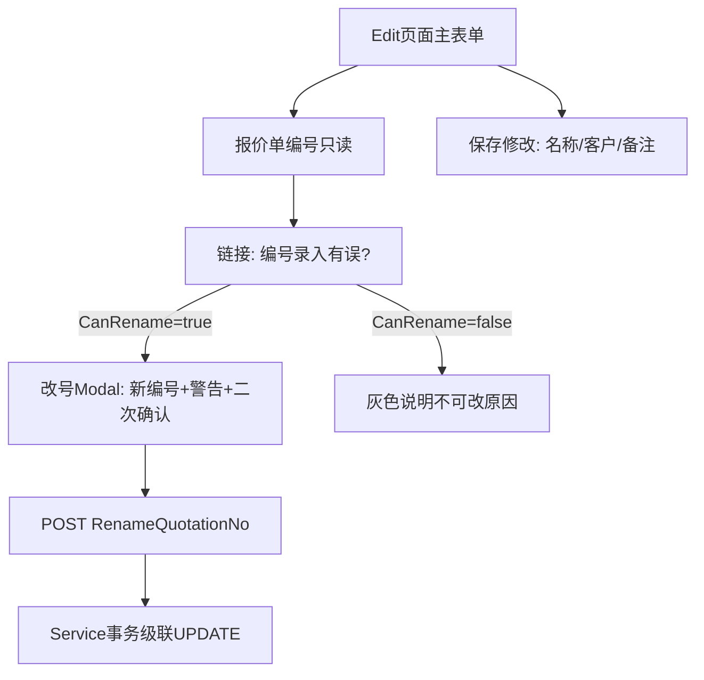

# 报价单编号纠错改号 — 设计与实施说明

> 业务规则原文：[Docs/修改方案编号fabh.txt](../修改方案编号fabh.txt)  
> 运行时需求索引：[quotation.md](./quotation.md) 第 4.1 节  
> 本文档自 Cursor 计划「报价单改号方案」整理入库，便于版本管理与 GitHub 提交。

**实施状态：已实现**（2026-06）

---

## 设计原则（不鼓励经常改）

**不要把编号做成普通可编辑输入框。** 主表单继续只读展示编号；改号作为**独立、低频、显式意图**的操作，与「保存名称/客户/备注」分离。

推荐 UX：**只读编号 + 条件性文字链 + 确认 Modal**

**为何合适：**

- 日常编辑路径看不到可改编号，降低误改欲望
- 只有满足业务条件才显示链接，否则显示**具体不可改原因**
- Modal 内集中风险说明 + `confirm()`，与普通过保存解耦
- 专用 POST 便于审计、权限与事务

改号成功后 **302 到新编号 Edit 页**，TempData 提示更新书签/链接。

---

## 业务规则

### 允许改号前置条件（全部满足）

| 编号 | 规则 | 实现 |
|------|------|------|
| 2.1 | `XMYLB` 中不存在 `bjd_fabh = 原编号` | `XmylbContracts.AnyAsync(x => x.bjd_fabh == oldFabh)` |
| 2.2 | `BJFAT.dqzt != 10` | 与列表 `CanShowRowActions` 一致 |
| 2.3 | `BJFAT.bjr = 当前登录用户` | 与 `DeleteAsync` 一致 |
| 2.4 | `BJFAT.fasj` 距今天 ≤ 30 天 | 按日期部分比较 |
| 2.5 | 新编号在 `BJFAT` 中不存在 | `AnyAsync(x => x.fabh == newFabh)` |

### 改号事务内 UPDATE 顺序

在同一事务中，`fabh` / `FABH` 为 **char(20)**，使用 **等值** `WHERE fabh = @old`（勿对列做 `LTRIM/RTRIM`，否则百万级表全表扫描超时）。

顺序：

1. `BJB` → `BJB_HZB` → `BJB_XMYJB` → `BJB_XMYJHZ` → `BJB_XMHZ`
2. `XM_YJB` → `XM_CKJS` → `XM_YJHZ` → `XM_HZ`
3. 最后 `BJFAT.fabh`（主键，须恰好更新 1 行）

不更新 `XMYLB`（有关联则前置拒绝）。不更新标注「未使用」的备份表、`STD_PRICE_BJ` 等。

改号事务临时 **CommandTimeout = 600 秒**；SQL 超时返回友好提示并回滚。

---

## 与普通 Edit 的权限差异

| 操作 | 条件 |
|------|------|
| 普通 Edit 保存 | 本人 + `dqzt≠10`（`ValidateEditAccessAsync` / `UpdateAsync`） |
| 纠错改号 | 上述 5 条全部满足（`CanRenameFabhAsync` / `RenameFabhAsync`） |

---

## 代码入口

| 层级 | 位置 |
|------|------|
| 接口 | `PanelFlow.Core/Interfaces/IQuotationService.cs` |
| 服务 | `PanelFlow.Infrastructure/Services/QuotationService.cs` |
| 控制器 | `PanelFlow.Web/Controllers/QuotationController.cs` — `RenameQuotationNo` POST |
| 视图 | `PanelFlow.Web/Views/Quotation/Edit.cshtml` |
| 脚本 | `PanelFlow.Web/wwwroot/js/quotation-edit.js` |
| 结果模型 | `PanelFlow.Core/Models/RenameFabhResult.cs` |

---

## 审计日志

改号写入 `SYS_AUDIT_LOG`，菜单：**系统管理 → 审计日志**。

| 字段 | 值 |
|------|-----|
| `ActionType` | `RenameFabh` |
| `Module` | `Quotation` |
| `EntityName` | `BJFAT` |
| `EntityId` | 原编号 |
| `BeforeData` | 原编号、名称、`dqzt`、`fasj`、尝试的新编号 |
| `AfterData` | 新编号 + 各表 `affectedRows`（成功时） |

成功/失败均记录；审计与业务事务分离（审计失败不回滚改号）。

---

## 前端防重复提交

用户确认改号后，「确认修改编号」按钮立即 `disabled`，并显示 spinner +「正在修改...」，避免长耗时请求期间重复点击。

---

## 验证清单

1. 满足全部条件 → 显示改号链接 → 改为未占用新号 → 各关联表旧号归零、新号有数据
2. `XMYLB.bjd_fabh` 有关联 → 不显示链接 / POST 拒绝
3. `dqzt=10` / 非本人 / 创建超过 30 天 → 拒绝并提示
4. 新号已存在于 `BJFAT` → 拒绝
5. 普通 Edit 不能改编号
6. 审计日志可搜 `RenameFabh` 或原编号
7. 改号进行中按钮不可再次点击

---

## 相关文档

- [修改方案编号fabh.txt](../修改方案编号fabh.txt) — 业务条件与级联表清单
- [tables_include_fabh.txt](../tables_include_fabh.txt) — 含 `fabh` 的表及使用标记
- [databaseStructure.csv](../databaseStructure.csv) — `fabh` 多为 `char(20)`
